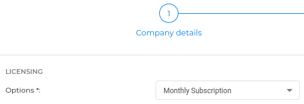
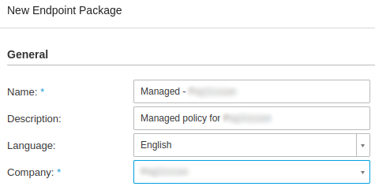
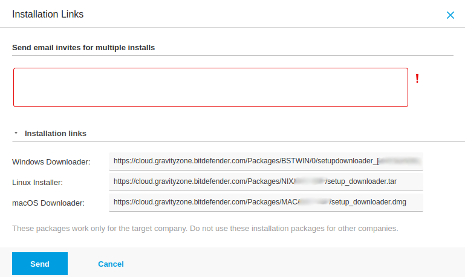

# BitDefender GravityZone Deployment

## How to Deploy BitDefender GravityZone

From the UI go to **Settings > Global Settings > CUSTOM FIELDS > Clients**.

Add a Custom Field:</br>

First: </br>
**Target** = `CLIENTS`</br>
**Name** = `bdurl`</br>
**Field Type** = `Text`</br>

<!---  -->

[![Service Name]][Service Name]

[Service Name]: images/3rdparty_bdg_RmmCustField.png

Log into your GravityZone and on the left hand side, select **Network > Packages**.


Select the client you are working with and click "Send Download Links" at the top. </br>


Copy the appropriate download link.


Paste download link into the `bdurl` when you right click your target clients name in the RMM.


Right-click the Agent you want to deploy to and **Run Script**. Select **BitDefender GravityZone Install** and set
timeout for 1800 seconds.

**Install time will vary based on internet speed and other AV removal by BitDefender BEST deployment**

## How to onboard a new company

Use these procedures to onboard a new company in Bitdefender.

1. Go to Companies > Add Company and fill out the details. The company type is "Customer".
   
2. Fill out the next tab for the authentication.
3. Fill out the last tab for the licensing. You probably want to use Monthly Subscription so that it's added to your
   monthly MSP subscription.
   
4. Next go to Network > Packages > Add to add a new package download for the company. Each company should have a
   separate download.
   
5. Select the company > Send download links. The Windows link is needed for the TRMM script to install Bitdefender. The
   Linux and Mac installer links are also provided but the script is for Windows only.
   

## Alert types

There are two general types of alerts: email and dashboard. While you may get both types of alerts for an incident, they
are not the same and configuring the exclusions are not the same. This section explains both types and how to add the
exclusions for each.

### Process alert

- Bitdefender
  docs: [notification settings](https://www.bitdefender.com/business/support/en/77209-94325-configuring-notifications-settings.html)

This is a process alert that is emailed and as the name suggests, it kills the process. If the parent process
is `C:\Windows\System32\services.exe`, the process is a service that just died. The detection type, ATC/IDS, indicates
the exclusion will need to include the ATC/IDS module.

**Detected Exploit** </br>
A harmful process has been detected by Behavior Scan on the following endpoint in your network:

| Detected Exploit Details |                                                       |
|--------------------------|-------------------------------------------------------|
| Company:                 | ACME Company, Inc.                                    |
| Computer Name:           | PC-Desktop01                                          |
| Computer IP:             | 192.168.1.69                                          |
| Installed Agent:         | Bitdefender Endpoint Security Tools                   |
| Command Line:            | C:\Program Files\TacticalAgent\tacticalrmm.exe -m svc |
| Parent Process Path:     | C:\Windows\System32\services.exe                      |
| Parent PID:              | 852                                                   |
| Exploit Type:            | ATC Application                                       |
| Exploit Path:            | C:\Program Files\TacticalAgent\tacticalrmm.exe        |
| Exploit Status:          | ATC/IDS Disinfected                                   |
| Last Blocked:            | 08 December 2022 08:55:59                             |
| Logged User:             | SYSTEM                                                |

Process notifications are configured in :bell: Notifications > :gear: Settings > ATC/IDS event.


### Quarantine alert

- Bitdefender docs: [quarantine](https://www.bitdefender.com/business/support/en/77209-89887-quarantine.html)

When a file is detected, it is quarantined by moving it to an encrypted folder on the endpoint. Email notifications
cannot be configured for quarantined files, although they are available via
the [API](https://www.bitdefender.com/business/support/en/77209-140256-getquarantineitemslist.html). The threat name,
Atc4.Detection, indicates the exclusion needs to include the ATC/IDS module.


## Troubleshooting and problem resolution

### MeshAgent.exe quarantine corrupts Mesh Agent service
When Bitdefender quarantines MeshAgent.exe, the service is corrupted. Here is what the service looks like before the
quarantine.

```text
[PC-Desktop3]: PS C:\> Get-CimInstance Win32_Service -Filter 'Name = "Mesh Agent"' | Format-List *


Name                    : Mesh Agent
Status                  : OK
ExitCode                : 0
DesktopInteract         : True
ErrorControl            : Ignore
PathName                : "C:\Program Files\Mesh Agent\MeshAgent.exe"
ServiceType             : Own Process
StartMode               : Auto
Caption                 : Mesh Agent
Description             : Mesh Agent background service
InstallDate             :
CreationClassName       : Win32_Service
Started                 : True
SystemCreationClassName : Win32_ComputerSystem
SystemName              : PC-Desktop3
AcceptPause             : False
AcceptStop              : True
DisplayName             : Mesh Agent
ServiceSpecificExitCode : 0
StartName               : LocalSystem
State                   : Running
TagId                   : 0
CheckPoint              : 0
DelayedAutoStart        : False
ProcessId               : 7612
WaitHint                : 0
PSComputerName          :
CimClass                : root/cimv2:Win32_Service
CimInstanceProperties   : {Caption, Description, InstallDate, Name...}
CimSystemProperties     : Microsoft.Management.Infrastructure.CimSystemProperties
```

This is what the service looks like after `MeshAgent.exe` is quarantined. Notice
the `PathName`, `ServiceType`, `StartMode` are "Unknown", and some properties are blank.

```text
[PC-Desktop3]: PS C:\> Get-CimInstance Win32_Service -Filter 'Name = "Mesh Agent"' | Format-List *


Name                    : Mesh Agent
Status                  : OK
ExitCode                : 1067
DesktopInteract         :
ErrorControl            : Unknown
PathName                :
ServiceType             : Unknown
StartMode               : Unknown
Caption                 : Mesh Agent
Description             :
InstallDate             :
CreationClassName       : Win32_Service
Started                 : False
SystemCreationClassName : Win32_ComputerSystem
SystemName              : PC-Desktop3
AcceptPause             : False
AcceptStop              : False
DisplayName             : Mesh Agent
ServiceSpecificExitCode : 0
StartName               :
State                   : Stopped
TagId                   :
CheckPoint              : 0
DelayedAutoStart        :
ProcessId               : 0
WaitHint                : 0
PSComputerName          :
CimClass                : root/cimv2:Win32_Service
CimInstanceProperties   : {Caption, Description, InstallDate, Name...}
CimSystemProperties     : Microsoft.Management.Infrastructure.CimSystemProperties
```

Restoring `MeshAgent.exe` from quarantine will make it "look" normal but will not have any permissions. Renaming,
deleting or moving the file results in a permission denied error. After a reboot, the `MeshAgent.exe` will be missing.

```text
[PC-Desktop3]: PS C:\Program Files\Mesh Agent> Rename-Item -Path .\MeshAgent.exe -NewName .\MeshAgent-Restored.exe
Rename-Item : Access to the path is denied.
    + CategoryInfo          : PermissionDenied: (C:\Program File...t\MeshAgent.exe:String) [Rename-Item], Unauthorized
   AccessException
    + FullyQualifiedErrorId : RenameItemUnauthorizedAccessError,Microsoft.PowerShell.Commands.RenameItemCommand
```

The best path for recovery is to leave the file in quarantine and run the [Win_TRMM_Mesh_Install.ps1][] script to have
Tactical RMM install the Mesh Agent. The existing config will be used and there will _not_ be duplicates.

[Win_TRMM_Mesh_Install.ps1]: https://github.com/amidaware/community-scripts/blob/main/scripts/Win_TRMM_Mesh_Install.ps1
