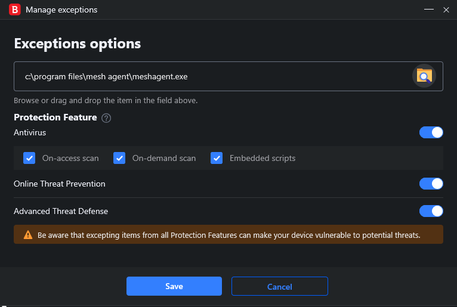
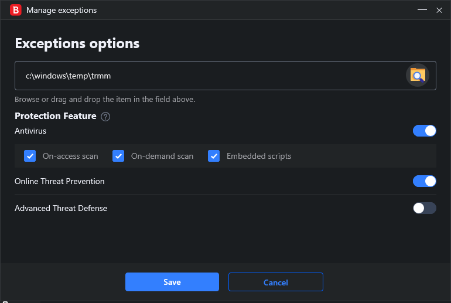

# BitDefender Total Security

## Exceptions

Open the app and select the Protection tab on the left.


Open Antivirus, Advanced Threat Defense, or Online Threat Protection. It doesn't matter which, simply select the Settings tab in any of them and click Manage exceptions.

Click the Add an Exception button.


You'll be greeted with this panel:


The buttons become available depending on what you enter for the path / URL. Antivirus allows folders and files. Online Threat Prevention allows URLS, files, folders, and *. Advanced Threat Defense allows only individual files.

BitDefender does not allow right click interactions in the entry field, so copy and paste using ctrl-c and ctrl-v if you want to do so.

Enter:

```cmd
C:\Program Files\Mesh Agent\MeshAgent.exe
```

And toggle the buttons for Advanced Threat Defense, Online Threat Prevention, and Antivirus. Under Antivirus, options for On-access scan, On-demand scan, and Embedded scripts appear. Select them all.



Repeat this process for:

```cmd
C:\Program Files\TacticalAgent\meshagent.exe
C:\Program Files\TacticalAgent\tacticalrmm.exe
C:\Program Files\TacticalAgent\unins000.exe
```

Next, add an exception for:

```cmd
C:\Windows\temp\trmm
```

Select all available options.



For the sake of caution, add the following and select the Online Threat Prevention option:

```cmd
C:\Program Files\Mesh Agent\*
C:\Program Files\TacticalAgent\*
C:\Program Files\TacticalAgent\nssm.exe
C:\Windows\Temp\tacticalagent-v*.exe
C:\temp\tacticalrmm*.exe
```

Add exceptions for your T-RMM URLs as well.

T-RMM seems to create other folders in `C:\Windows\Temp` as well, but so far no problems have come up from this. **Do not** exclude the entire Temp folder.

That should be all that's needed, unless BitDefender complains about the T-RMM agent installation file, in which case you'll need to add an exception for it as well, selecting all available options, then re-download it and save it in the same location to be safe.
