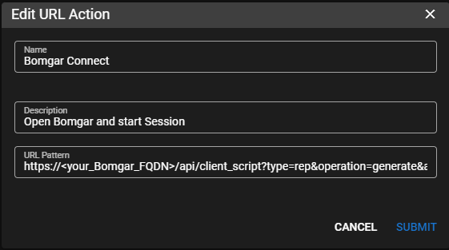

# Bomgar / BeyondTrust Remote Support

## Bomgar / BeyondTrust Integration

!!!info
     To make this work you will need to already have the Bomgar / BeyondTrust agent pinned, installed and running on a Bomgar Guest.

In TRMM go to Global Settings go to **URL ACTIONS**

Add a URL Action</br>
**Name** = `Bomgar Connect`</br>
**Description** = `Open Bomgar and Start Session`</br>
**URL Pattern** =

```html
https://<your_Bomgar_FQDN>/api/client_script??type=rep&operation=generate&action=start_jump_item_session&client.hostname={{agent.hostname}}&client.private_ip={{agent.local_ips}}&jump.method=pinned&session.custom.custom_field1=Custom%20Value&session.custom.custom_field2=123Note:
```



Click **Summit**

Give it a second to execute then right click the agent that you are working with and go to **Run URL Action > BomgarConnect**

It should ask you to sign into your Bomgar Representative Console if you are not already logged in and launch the session.
