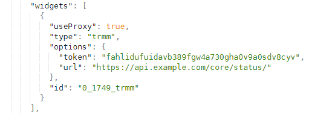

# Dashy

## Dashy Integration

!!!info
    This is a Dashy integration for Tactical RMM to see server status in your dashboard.

### Enable Monitoring Endpoint

SSH into your TRMM server as the user who installed Tactical

Edit the `local_settings.py` file found at /rmm/api/tacticalrmm/tacticalrmm

Add a new line at the botton with `MON_TOKEN` and give it a secure token value

`MON_TOKEN = "fahlidufuidavb389fgw4a730gha0v9a0sdv8cyv"`

Now run the command `sudo systemctl restart rmm`

### Add Widget to Dashboard

While in the config editor add the widget to your desired section.

Widget Options: 
**useProxy** = `true` 
**type** = `trmm` 
**options**: 
**token** = `Your MON_TOKEN` 
**url** = `Api url of your instance`

Preview or save your config and you should now see the Tactical RMM Status widget.

