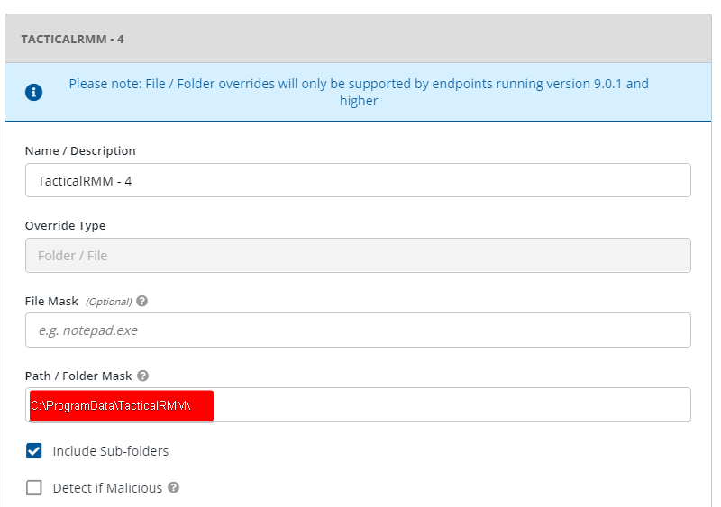
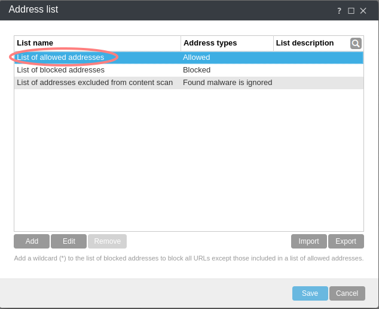

# Antivirus

They are usually fraught with false-positives because we live in a world of complex greys, not black and white.

At the moment, Microsoft Windows Defender thinks a go executable with virtually nothing in it is the "Trojan:Win32/Wacatac.B!ml" virus <https://old.reddit.com/r/golang/comments/s1bh01/goexecutables_and_windows_defender/>.

- Windows Defender ranks as one of the top AVs and can be largely controlled via Tactical. Read more about Defender detection rates etc [here](https://www.av-test.org/en/antivirus/business-windows-client/windows-10/october-2022/microsoft-defender-antivirus-4.18-222516/).
- Use the `Defender Status Report` script (Task > Run Daily - Use Automation manager) to monitor machines: <https://github.com/amidaware/community-scripts/blob/main/scripts/Win_Defender_Status_Report.ps1>.
- If you want to lock a system down, run the `Defender Enable` script (test in your environment, because it can stop Microsoft Office from opening docs among MANY other things) that will turn on Protected Folders: <https://github.com/amidaware/community-scripts/blob/main/scripts/Win_Defender_Enable.ps1> and you will be extremely safe. Annoyed, and unable to do lots of dangerous things like opening files from the internet and email...but safe. Use [this](https://github.com/amidaware/trmm-awesome/blob/main/scripts/Windows_Defender_Allowed_List.ps1) as an Exclusion List for Protected Folders items.

Be aware there is also [a PowerShell script](https://github.com/amidaware/community-scripts/blob/main/scripts/Win_TRMM_AV_Update_Exclusion.ps1) to add TRMM exclusions specific to Windows Defender.

!!!note
    If you need to use 3rd party AV, add the necessary exclusions (see below for examples) and submit the exes as safe.

## Bitdefender Gravityzone

Admin URL: <https://cloud.gravityzone.bitdefender.com/>

To exclude the Tactical and MeshCentral agents, go to **Policies > {policy name} > Antimalware > Settings > Custom Exclusions**.


Add the following exclusions. The ATS/IDS module does not support file exclusions, only folder exclusions.

| File    | Excluded Items                                 | Modules                       | Notes                                                      |
| ------- | ---------------------------------------------- | ----------------------------- | ---------------------------------------------------------- |
| Folder  | `C:\ProgramData\TacticalRMM\`                  | On-demand, On-Access, ATC/IDS | All TRMM scripts are saved here to run                     |
| Folder  | `%ProgramFiles%\Mesh Agent\`                   | On-demand, On-Access, ATC/IDS | Excludes Mesh Agent from ATC/IDS                           |
| Folder  | `%ProgramFiles%\TacticalAgent\`                | On-demand, On-Access, ATC/IDS | Excludes TacticalAgent from ATC/IDS                        |
| Process | `%ProgramFiles%\Mesh Agent\MeshAgent.exe`      | On-Access, ATC/IDS            | Excludes `Mesh Agent` service (process) from ATC/IDS       |
| Process | `%ProgramFiles%\TacticalAgent\tacticalrmm.exe` | On-Access, ATC/IDS            | Excludes `tacticalrmm` service (process) from ATC/IDS      |
| File    | `%ProgramFiles%\Mesh Agent\MeshAgent.exe`      | On-demand, On-Access          | This may not be needed since the entire folder is excluded |
| File    | `%ProgramFiles%\TacticalAgent\tacticalrmm.exe` | On-demand, On-Access          | This may not be needed since the entire folder is excluded |


To exclude URLs: **Policies > {policy name} > Network Protection > Content Control > Settings > Exclusions**


## Webroot

Admin URL:




## Sophos

### Sophos Central Admin

Go To **Global Settings > General > Global Exclusions > Add Exclusion**


### Sophos XG Firewall


Log into Sophos Central Admin:

Admin URL: <https://cloud.sophos.com/>

Log into the Sophos XG Firewall.

Go To **System > Hosts and services > FQDN Host Group** and create a new group.


Go To **System > Hosts and services > FQDN Host**.

Create the following 3 hosts and add each to your FQDN host group.

- api.yourdomain.com
- mesh.yourdomain.com
- rmm.yourdomain.com (Optional if you want your client to have GUI access to Tactical RMM)


Go To **Hosts and services > Services** and create the following services:

- Name: Tactical-Service-443
    - Protocol: TCP
    - Source port: 1:65535
    - Destination port: 443


Go To **Hosts and services > Service group** and create the following service group:


Go To **Protect > Rules and policies** and add a firewall rule:

- Rule name: Tactical Rule
- Rule position: Top
- Source zones: LAN
- Source networks: ANY
- Destination zones: WAN
- Destination networks: Your FQDN Host Group
- Services: Tactical Services


Optionally select **Log Firewall Traffic** checkbox for troubleshooting.

## ESET PROTECT Console

There are three areas where you need to configure exclusions:

1. **Detection Engine > Performance Exclusions**
   
   

2. **Web Access Protection > URL Address Management > List of addresses excluded from content scan**
   
   
   

3. **Web Access Protection > URL Address Management > List of allowed addresses**
   
   

## UTM Filter Bypasses

Use the below if your UTM blocks installation of Tactical RMM

```^https?://([A-Za-z0-9.-]*\.)?tacticalrmm\.com\.?/```


