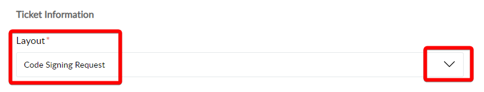

# Code Signing

*Version added: Tactical RMM v0.6.0 / Agent v1.5.0* (April 2021)

Tactical RMM agents are now [code signed](https://comodosslstore.com/resources/what-is-microsoft-authenticode-code-signing-certificate/)!

To get access to code signed agents (which also includes Linux/macOS agents) and [Single Sign-On](./ee/sso/sso.md), you must be a [Sponsor](sponsor.md) with a minimum **monthly** [Tier 1](sponsor.md#sponsor-with-stripe-or-paypal) sponsorship.

*To get access to our [Reporting](./ee/reporting/reporting_overview.md) feature, you must be a sponsor with a minimum monthly **Tier 2** sponsorship. Exceptions will be made for [Founders](./ee/reporting/functions/faq.md#pricing) and Non-Profits which will only require Tier 1.*

One token is valid for 1 self hosted instance. If you have more than 1 instance please contact [support](https://support.amidaware.com/) for pricing options.

Once you have become a [Sponsor](sponsor.md), open a [support ticket](https://support.amidaware.com/) and choose the "Code Signing Request" layout.



Select the payment method you paid with from the dropdown.

If you sponsored via [Stripe or Paypal](sponsor.md#sponsor-with-stripe-or-paypal) and your contact email is different from the email you used to pay, please let us know that in the ticket.

Enter the API subdomain you will be using for your instance (e.g. `api.example.com`).

If you already have an existing token and want to switch your sponsorship from github to stripe/paypal, make sure to mention that in the ticket description and include your github username. Don't forget to also cancel your github sponsorship after you have successfully setup Paypal/Stripe.

If you have joined our [Discord](https://discord.gg/upGTkWp) and would like to be added to the sponsors role, include your Discord username as well.

Please allow up to 24 hours for a response.

## How does it work?

Every time you generate an agent or an agent does a self-update, your self-hosted instance sends a request to Tactical's code signing servers with your auth token.

If the token is valid, the server sends you back a code signed agent. If not, it sends you back the un-signed agent.

If you think your auth token has been compromised or stolen then please [open a ticket](https://support.amidaware.com/) to get a new token / invalidate the old one.

## Why should I pay for Code Signing?

1. Code signing costs a lot of money. OV code signing requires a legitimate legal business...Amidaware was setup for this purpose. Code signing + operating a business costs thousands of dollars a year.
2. It helps the project move forward and it can supports devs spending time on it, they have lives, wives, jobs and kids which all demands attention.
3. It should stop bad actors using it maliciously.
4. It helps with Antivirus products detecting it as being malicious.

## Tactical RMM is getting flagged as PUA or virus, will this fix it?

Getting a code signed agent helps, but it is not guaranteed to eliminate this entirely. This is because AVs are unpredictable, changing all the time, constantly making new decisions and rules, telling you one thing and doing another, all doing different things in slightly different ways, etc.

However, the best way to submit a whitelisting request to your AV for the TRMM agent... is having a code signed exe to submit.

Right click `"C:\Program Files\TacticalAgent\tacticalrmm.exe"` > `Properties` > `Digital Signatures` tab.

## Code signing certificate info

Digicert OV code signing cert used by agents v2.7.0 and above:

 - Serial Number: `0f558fcc46f23aa4e2688052f3a9459f`

 - Thumb Print: `5f67afdbb3adc263965f5ed0c732e45575434449`

Digicert OV code signing used by agents v2.6.2 and below:

 - Serial Number: `0fef30ccce9d30183067160018796558`

 - Thumb Print: `0e4844266294100d3f93e1cc7eecf61e9206bb14`

Amidaware code signing used only by the dynamic EXE installer after May 3, 2024 at 4:59 PM PST:

 - Serial Number: `0229c833c9bda1fe0a306f4b12b6ab3cf40f5790`

 - Thumb Print: `17a930357440276bfaee23220e2f7e8f1a208556`

Amidaware Code Signing [Root CA](https://amidaware.com/amidaware-root.crt):

 - Serial Number: `2d4486df7eba0c6659d79106783caac1a83ffb41`

 - Thumb Print: `45492337c44055dbb3910a90d4ed02758ebc0ebd`

#### Code Signing Changes for Dynamic EXE Installers
Starting May 3, 2024, at 4:59 PM PST, all new [dynamically generated](./install_agent.md#dynamically-generated-executable) EXE installers, including deployment link installers, will now be signed with Amidaware's own code signing certificate, issued by Amidaware's Code Signing Root CA. This change has been prompted by industry-wide modifications to code signing practices, which now necessitate the use of hardware tokens or HSMs (Hardware Security Modules). These requirements make it unfeasible for us to continue using our Digicert code signing certificate for signing these dynamically generated installers.

While we have already transitioned to using Digicert's HSM to store our private key, this approach now incurs a cost for **each** executable signed. Given the volume of dynamic EXEs we currently generate and sign for all our customers, currently around 250,000 per month as of May 2024, this would result in costs around **$62,000.00 USD** per month—an unsustainable increase from the previously **nonexistent** cost.

Please note that the Inno Setup installer (`tacticalagent-vX.X.X-windows-arch.exe`), utilized by both the [Powershell](./install_agent.md#powershell) and [Manual](./install_agent.md#manual) installation methods, as well as the agent update method, will continue to be signed with our Digicert OV code signing certificate. The `tacticalrmm.exe` agent binary will also continue being signed with our Digicert OV cert.

As a reminder, the dynamic EXE installer is a generally one-time use **standalone program** that simply serves as a convenience wrapper around the Manual installation method. It automates the process by downloading the Inno Setup installer and executing it with the necessary command-line arguments—mirroring the functionality provided by the Powershell installer but delivered in an EXE format.

#### Optional Root CA Installation for Dynamic EXE Installers:

For those using the dynamic EXE installation method, installing Amidaware's Code Signing Root CA on your system before you attempt installation can help ensure a smoother installation process. This step is entirely optional and is not needed for existing agents of if you use any of the other installation methods. To install the Root CA, you can run the following PowerShell command (as admin):

```powershell
Invoke-WebRequest -Uri "https://amidaware.com/amidaware-root.crt" -OutFile "amida-root.crt"; Import-Certificate -FilePath "amida-root.crt" -CertStoreLocation Cert:\LocalMachine\Root
```


