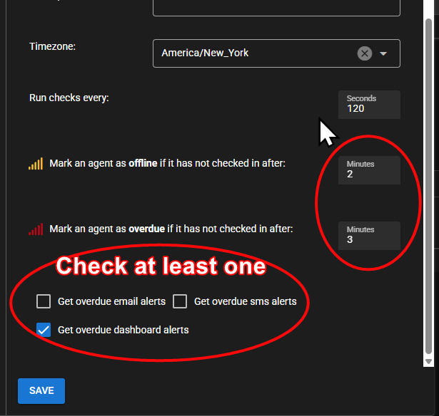
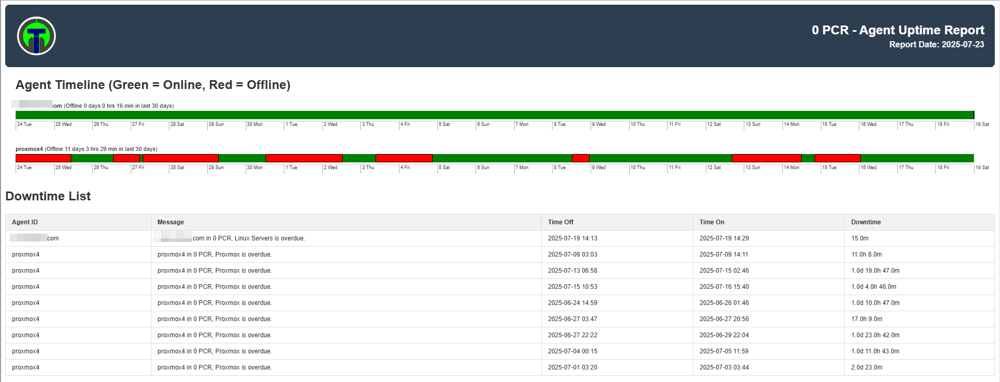
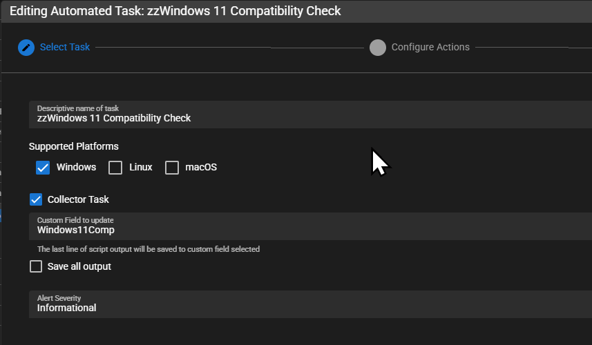

# Example Reports

## Agent Uptime

1. Import the `Agent Uptime_By Client (html)` report from the Shared Templates Report library
2. Check at least one overdue item in agent settings 
3. Run report and enjoy!

## Windows 11 Upgrade Compatible list

To get a Windows 10 upgrade to Windows 11 compatibility list you'll want to:

1. Create an agent custom field 
2. Create an automation policy that applies to all your workstations   
3. Import one of the `Windows 11 Compatible` Reports 
4. Enjoy!

## NOC Dashboard

Got a TV? Load it up for the team!

Want quick searchable agent status with more data? Load it locally!

The `Restrict Summary` button is for only showing agents that are offline and have an overdue alert set (eg critical machines). If it's on a hands off device make sure you set the refresh every so it's reloading data regularly.

  <iframe width="400" height="225" src="https://www.youtube.com/embed/OtV2M5uYj_k" frameborder="0" allowfullscreen></iframe>

## Software Inventory

`Software Inventory_By Software Name`

Search for software, sort by different columns

`Software Report - Advanced DataTables`

