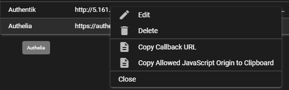
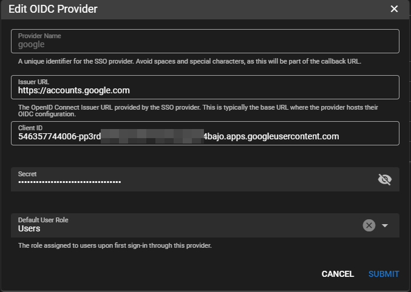
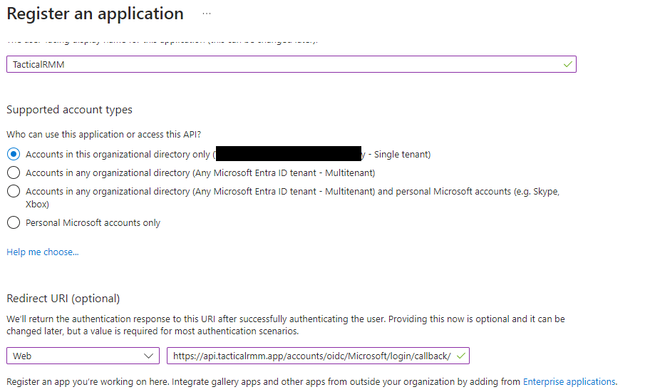
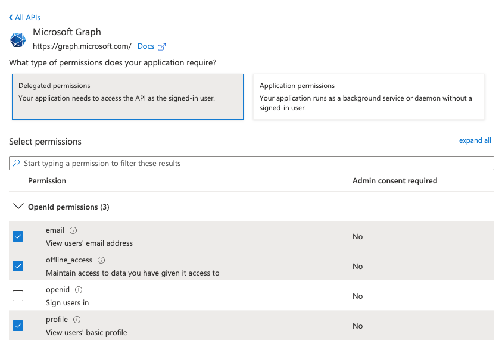
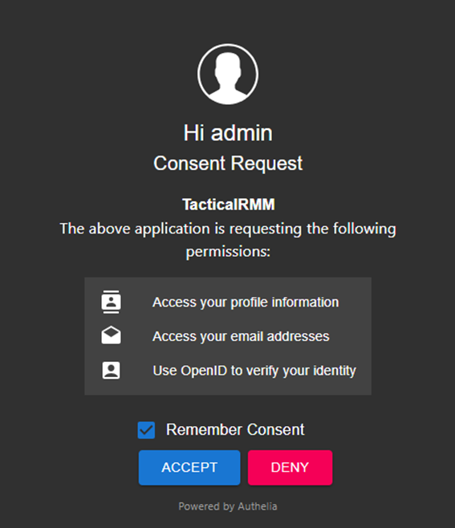
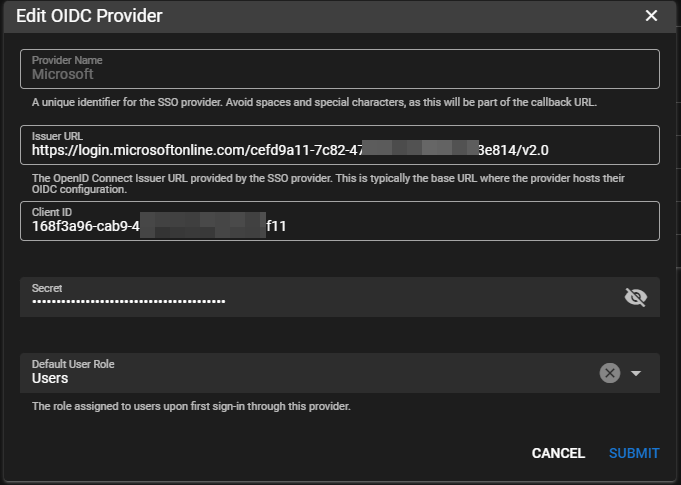

# SSO - Single Sign-on

*Version added: Tactical RMM v0.20.0

Tactical RMM's Single Sign-On (SSO) integration streamlines user authentication and enhances security by enabling seamless access across multiple platforms. This SSO integration allows for centralized identity management, reducing login fatigue and providing robust security through protocols such as OAuth, and OpenID Connect. Tactical RMM’s SSO support enables organizations to leverage their existing Identity Providers (IdPs) enforcing strict authentication policies and simplifying the user experience. Administrators can easily configure SSO settings to control access, apply role-based permissions, and enable Multi-Factor Authentication (MFA) providing a secure and efficient authentication framework within Tactical RMM. This setup minimizes manual credential management while ensuring compliance and streamlined onboarding/offboarding processes.

## Licensing Required

SSO will be available to all Sponsors at any level and all Hosted plans.

## Warnings

Names AND vaLUES in TRMM and your SSO application are interdependant, must match and are cAse sEnsitive. Following these instructions and copying/pasting names exactly will result in successful connections. You have been forewarned


## Video Walkthru

<div class="video-wrapper">
  <iframe width="400" height="225" src="https://www.youtube.com/embed/Qh9BfKo2wIg" frameborder="0" allowfullscreen></iframe>
</div>

## Global Settings

You can globally enable or disable SSO and Block Local User Login using the settings dialog.


Right-click to find URLs to copy



## Google Workspace



## Microsoft Entra ID / Azure

Register an application

* Go to <https://entra.microsoft.com/> (Previously Azure Active Directory), in the left sidebar select **Applications** > **App registrations**
* Select “+ New registration”
* Name: `TacticalRMM`
* Choose “Accounts in this organizational directory only”
* 
* For the Redirect Uri choose “Web” and enter the URL: `https://<TRMM API URL ie api.example.com>/accounts/oidc/Microsoft/login/callback/` (Note: _Requires https_)
* Save the new app
* Copy the “Directory (tenant) ID”
* In TRMM click `Add OIDC Provider` button
* Provider Name: `Microsoft`
* Issuer URL: `https://login.microsoftonline.com/<replace with Directory (tenant) ID above>/v2.0`

API Permissions

* In Microsoft select “API permissions” in the sidebar
* Click on “Add a permission” and add delegated email, offline_access, and profile permissions from the Microsoft Graph API.
* 

Certificates and secrets FIXME TODO

* Select “Certificates and secrets” in the left sidebar
* Select “+ New client secret”, name it `TacticalRMM`. Copy the secret value and paste into TRMM's Secret
* 



## Authentik

Assumes you've already [installed Authentik](https://docs.goauthentik.io/docs/install-config/install/docker-compose).

Can use DNS name (recommended) or IP for Authentik server.

In TRMM 

* Click `Add OIDC Provider` button
* Give Provider Name: `Authentik`

In Authentik

* Create Provider > OAuth2/OpenID Provider
* Name: `TacticalRMM`
* Authentication Flow: `default-authentication-flow (Welcome to authentik!)`
* Authorization flow: `default-provider-authorization-explicit-consent (Authorize Application)`
* Client Type: Confidential
* Client ID: Copy from Authentik and paste into TRMM Client ID
* Client Secret: Copy from Authentik and paste into TRMM Secret
* Redirect URIs/Origins (Regex): Adjust this to your TRMM servers API URL and paste `https://<TRMM API URL ie api.example.com>/accounts/oidc/Authentik/login/callback/` (also found in the right-click menu of the TRMMs SSO Provider)
* Signing Key: `authentik Self-signed Certificate`


Create Authentik Application

* Name: `TacticalRMM`
* Slug: `tacticalrmm`
* Provider: Choose `TacticalRMM` and Create


In TRMM

* Issuer URL: `http://<authentik server dns/ip>:9000/application/o/tacticalrmm/.well-known/openid-configuration`
* Select your desired Default User Role from TRMM Permissions
* Submit and test!


## Keycloak

In TRMM

* Click `Add OIDC Provider` button
* Give Provider Name: `KeyCloak`

In KeyCloak

* Click Clients. Create client
* Client type: `OpenID Connect`
* Client ID: `tacticalrmm`. Also paste into TRMM "Client ID" field
* Name: `TacticalRMM`
* Hit Next
* Enable `Client Authentication`
* 
* Hit Next
* Root URL: `https://<TRMM rmm url ie rmm.tacticalrmm.app>`
* Enter Valid Redirect URL: `https://<TRMM API URL ie api.example.com>/accounts/oidc/KeyCloak/login/callback/`
* Web Origins: `https://<TRMM rmm url ie rmm.tacticalrmm.app>`
* Hit Save
* Go to Credentials tab and copy Client Secret.

In TRMM

* Paste into TRMMs Secret field
* Issuer URL: `https://<authentik server dns/ip>:8443/realms/master/.well-known/openid-configuration`
* Set Default User Role and Submit

In KeyCloak TODO

* Create Role

Users

1. Create new user or use existing
2. Go to Users and assign Role via Role Mapping

Tactical RMM

1. Add SSO Provider
2. Name: `KeyCloak`
3. Client ID from step 1 in Create Client
4. Secret from Step 8
5. Assign default roles
6. Save


## Authelia


Generate Client secret with <https://www.authelia.com/integration/openid-connect/frequently-asked-questions/#client-secret>

Add config to bottom of Authelia Config (presumably all setup already)

```
identity_providers:
  oidc:
	## The other portions of the mandatory OpenID Connect 1.0 configuration go here.
	## See: https://www.authelia.com/c/oidc
	clients:
  	- client_id: 'tacticalrmm'
    	client_name: 'TacticalRMM'
    	client_secret: '$pbkdf2-sha512$310000$RJhFsh2Vz.18TX81znDaeA$wDEv6CQSE8zK8ApzfQyzd69fUjuIwSEduircgT/cQnlOm4qrgfxq9JMzmtGQrGV2ZgI812tomyqnFBGQrLXyWQ'
    	public: false
        authorization_policy: 'two_factor'
    	require_pkce: true
        pkce_challenge_method: 'S256'
    	redirect_uris:
      	- 'https://api.tacticalrmm.app/accounts/oidc/Authelia/login/callback/'
    	scopes:
      	- 'openid'
      	- 'profile'
      	- 'groups'
      	- 'email'
        userinfo_signed_response_alg: 'none'
        token_endpoint_auth_method: 'client_secret_basic'
        pre_configured_consent_duration: '1 year'
```
