# SSO - Single Sign-on

*Version added: v0.20.0*

## Intro
Tactical RMM's Single Sign-On (SSO) feature supports all OIDC-compatible authentication providers out of the box, allowing flexible integration with providers like Google, Microsoft, or any other that supports the OpenID Connect (OIDC) standard. 

This approach enables you to configure any compatible provider by simply entering its URL, giving you the freedom to choose the identity provider that best suits your needs without specific provider dependencies.

## Video Walkthru

<div class="video-wrapper">
  <iframe width="400" height="225" src="https://changeme" frameborder="0" allowfullscreen></iframe>
</div>

## License

The SSO feature is released under the [Tactical RMM Enterprise License](https://license.tacticalrmm.com/ee) and requires a [Tier 1](../../sponsor.md#sponsor-with-stripe-or-paypal) or higher sponsorship.

## Enable SSO

SSO can be enabled via **Global Settings > SSO**. There is also an option to block regular user logins, allowing only SSO sign-ons (with the exception of local superusers).

!!! note ""
	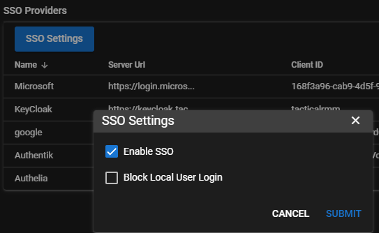

## Add OIDC Provider

**Provider Name:** A unique identifier for the SSO provider. Name this whatever you want, but avoid spaces and special characters, as this will be part of the callback URL. This name will appear on the Tactical RMM Login page.

**Issuer URL:** The OpenID Connect Issuer URL provided by the SSO provider. This is typically the base URL where the provider hosts their OIDC configuration.

!!! note "Issuer URL examples"

	GitLab: `https://gitlab.com`

	Apple: `https://appleid.apple.com`

	Twitch: `https://id.twitch.tv/oauth2`

	Facebook: `https://www.facebook.com`

	Mattermost: https://developers.mattermost.com/integrate/admin-guide/admin-oauth2/#oauth-endpoints


**Client ID:** A unique identifier provided by your OIDC provider that represents your application, allowing the provider to recognize it during the authentication process.

**Secret:** A secure key provided by your OIDC provider, used in combination with the Client ID to authenticate your application and ensure secure communication between your app and the provider.

**Default User Role:** The Tactical RMM [Role](../../functions/permissions.md) that should be assigned to the SSO user on first sign in.

!!! note ""
	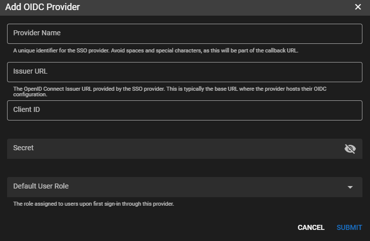

## Examples

### Google Workspace

!!!info
	Using Google as an OAuth provider is only supported if you are using Google Workspace.

**1. Create a Project**

1. Open the [google cloud console](https://console.cloud.google.com)

2. Create a project or use an existing one

3. Go to the [Auth Overview](https://console.cloud.google.com/auth/overview) page and click on the 'Getting Started' button to setup the project. Select Internal for the user type.

**2. Setup Branding**

1. Setup [Branding (OAuth consent screen)](https://console.cloud.google.com/auth/branding)

	* Make sure that "Authorized domains" includes the root domain of your instance.

	!!! note ""
		

**3. Create a Client**

1. Create a [client](https://console.cloud.google.com/auth/clients)

	* Application type: Web application
	* Name: Tactical RMM
	* Do **not** add javascript or redirect urls yet, we'll come back to this.

2. Click Create.

3. Click on the newly created client to open it and then copy the Client ID and Secret.

	!!! note ""
		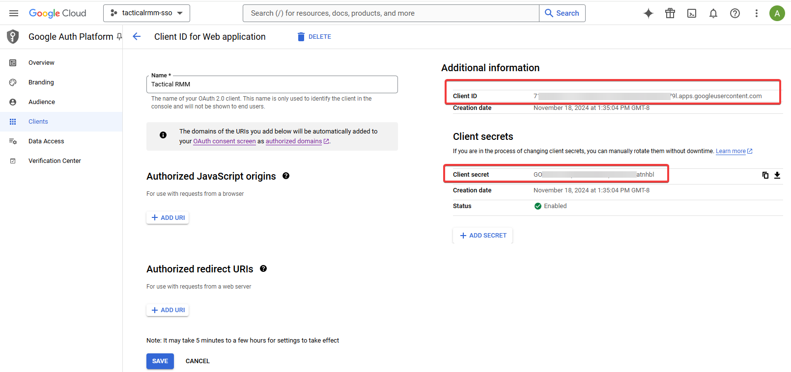

**4. Add Provider in TRMM**

Provider Name: `Google`

Issuer URL: `https://accounts.google.com`

Client ID and Secret: what you just copied.

Default User Role: choose a role.

Click **Submit**


**5. Add Callback URLs**

1. Right click on the provider in TRMM and copy both the Callback URL as well as the Allowed Javascript Origin

	!!! note ""
		

2. Go back to the Client screen in the Google console and paste in the 2 copied urls. **Note: Callback URL = Authorized redirect URI**

	!!! note ""
		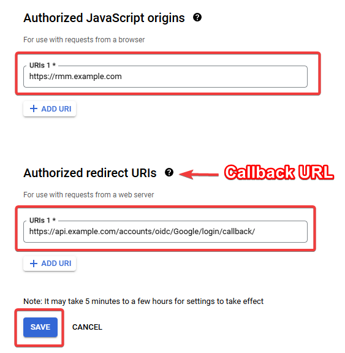


### Microsoft Entra ID / Azure

**1. Register an application**

1. Go to <https://entra.microsoft.com> (Previously Azure Active Directory), in the left sidebar select **Applications** > **App registrations**

2. Click "+ New registration"

	* Name: `TacticalRMM`
	* Choose "Accounts in this organizational directory only"

3. Click **Register**

	!!! note ""
		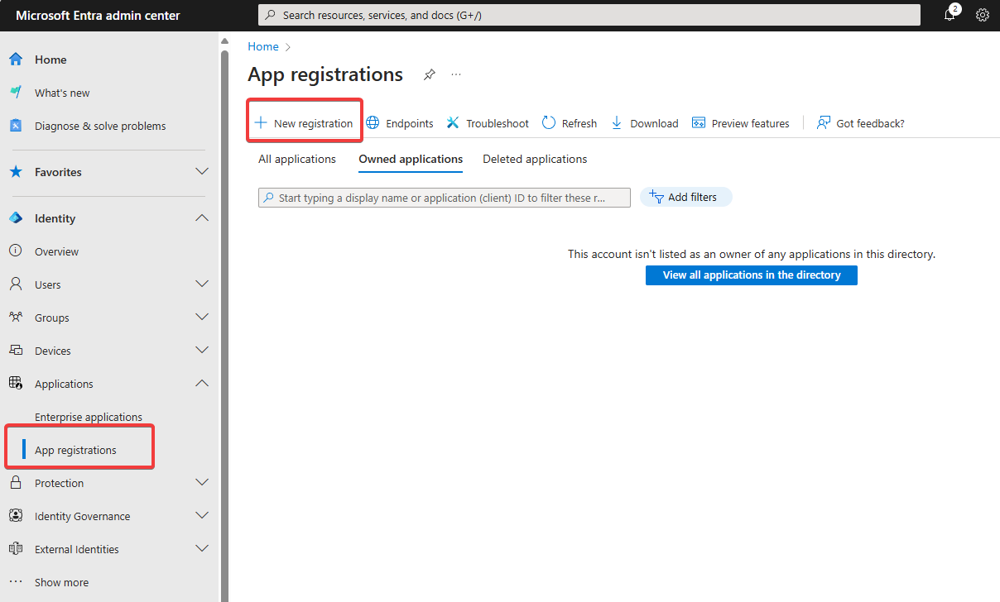

	!!! note ""
		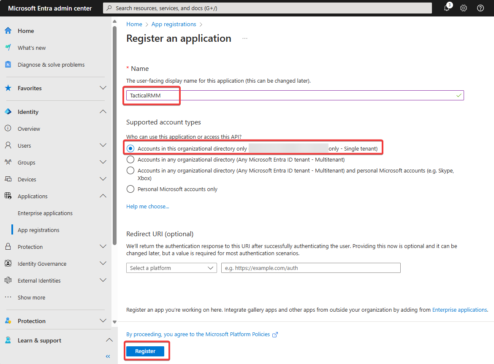

**2. Tenant ID**

1. Copy the "Directory (tenant) ID" and save it somewhere.

	!!! note ""
		


**3. API Permissions**

1. Select "API permissions" from the left sidebar, click "Add a permission" > Delegated permissions and select "email", "offline_access" and "profile"

	!!! note ""
		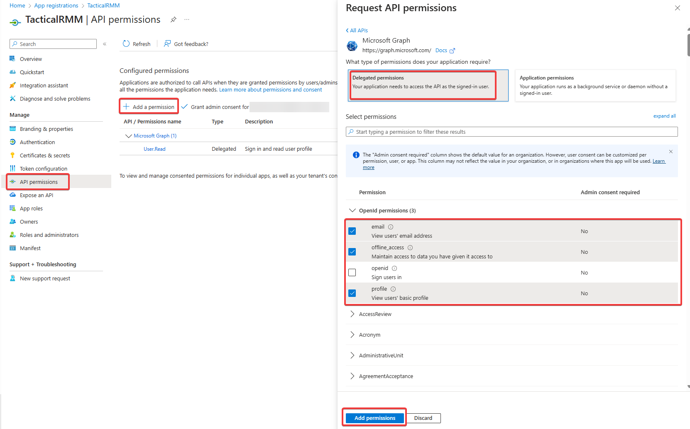


**4. Certificates and secrets**

1. Select "Certificates and secrets" in the left sidebar, Select "+ New client secret", name it something like "tacticalrmm", choose and expiration date and **make a note of the resulting secret value**.

	!!! note ""
		

	!!! note ""
		

**5. Add Provider in TRMM**

1. Provider Name: `Microsoft`

* Issuer URL: https://login.microsoftonline.com/{==replace with tenant ID==}/v2.0

	* Replace the tenant ID with the ID from step 2 above.
	* For example: `https://login.microsoftonline.com/cefd9a11-7c82-4795-81cd-06a91053e814/v2.0`

3. Client ID: copy this from the Overview tab in the Entra portal:

	!!! note ""

		

4. Secret: paste in the secret you copied from Step 4.

5. Default User Role: choose a role.

6. Click **Submit**

	!!! note ""
		

**6. Add Redirect URI**

1. Copy the Callback URL from the TRMM Providers List

	!!! note ""
		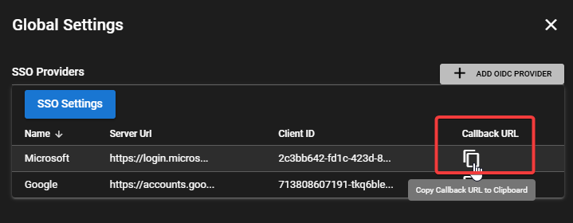

2. In the Entra portal, go to the Authentication tab in the left sidebar, click "+ Add a platform", choose "Web" and enter the Calllback URL you just copied.

	!!! note ""
		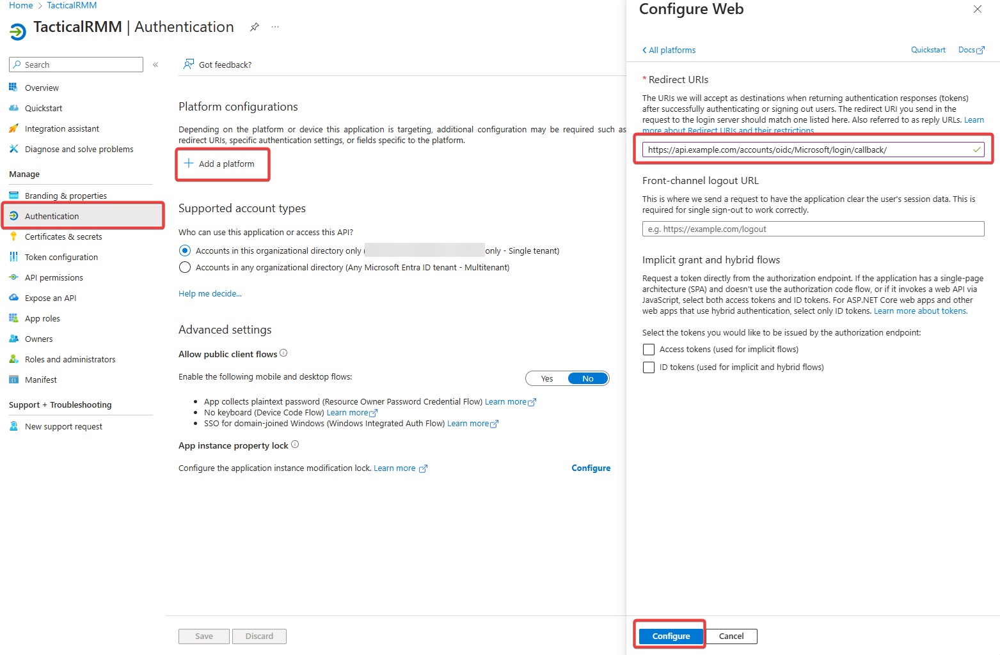


### Authentik

Assumes you've already [installed Authentik](https://docs.goauthentik.io/docs/install-config/install/docker-compose).

Can use DNS name (recommended) or IP for Authentik server.

In TRMM 

* Click `Add OIDC Provider` button
* Give Provider Name: `Authentik`

In Authentik

* Create Provider > OAuth2/OpenID Provider
* Name: `TacticalRMM`
* Authentication Flow: `default-authentication-flow (Welcome to authentik!)`
* Authorization flow: `default-provider-authorization-explicit-consent (Authorize Application)`
* Client Type: Confidential
* Client ID: Copy from Authentik and paste into TRMM Client ID
* Client Secret: Copy from Authentik and paste into TRMM Secret
* Redirect URIs/Origins (Regex): Adjust this to your TRMM servers API URL and paste `https://<TRMM API URL ie api.example.com>/accounts/oidc/Authentik/login/callback/` (also found in the right-click menu of the TRMMs SSO Provider)
* Signing Key: `authentik Self-signed Certificate`


Create Authentik Application

* Name: `TacticalRMM`
* Slug: `tacticalrmm`
* Provider: Choose `TacticalRMM` and Create


In TRMM

* Issuer URL: `http://<authentik server dns/ip>:9000/application/o/tacticalrmm/.well-known/openid-configuration`
* Select your desired Default User Role from TRMM Permissions
* Submit and test!


### Keycloak

In TRMM

* Click `Add OIDC Provider` button
* Give Provider Name: `KeyCloak`

In KeyCloak

* Click Clients. Create client
* Client type: `OpenID Connect`
* Client ID: `tacticalrmm`. Also paste into TRMM "Client ID" field
* Name: `TacticalRMM`
* Hit Next
* Enable `Client Authentication`
* 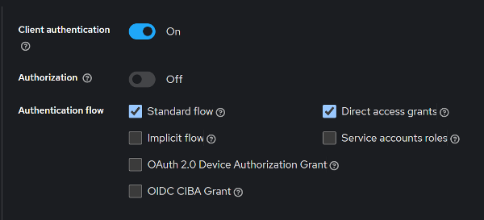
* Hit Next
* Root URL: `https://<TRMM rmm url ie rmm.tacticalrmm.app>`
* Enter Valid Redirect URL: `https://<TRMM API URL ie api.example.com>/accounts/oidc/KeyCloak/login/callback/`
* Web Origins: `https://<TRMM rmm url ie rmm.tacticalrmm.app>`
* Hit Save
* Go to Credentials tab and copy Client Secret.

In TRMM

* Paste into TRMMs Secret field
* Issuer URL: `https://<authentik server dns/ip>:8443/realms/master/.well-known/openid-configuration`
* Set Default User Role and Submit

In KeyCloak

* Create Role

Users

1. Create new user or use existing
2. Go to Users and assign Role via Role Mapping

Tactical RMM

1. Add SSO Provider
2. Name: `KeyCloak`
3. Client ID from step 1 in Create Client
4. Secret from Step 8
5. Assign default roles
6. Save


### Authelia


Generate Client secret with <https://www.authelia.com/integration/openid-connect/frequently-asked-questions/#client-secret>

Add config to bottom of Authelia Config (presumably all setup already)

```
identity_providers:
  oidc:
	## The other portions of the mandatory OpenID Connect 1.0 configuration go here.
	## See: https://www.authelia.com/c/oidc
	clients:
  	- client_id: 'tacticalrmm'
    	client_name: 'TacticalRMM'
    	client_secret: '$pbkdf2-sha512$310000$RJhFsh2Vz.18TX81znDaeA$wDEv6CQSE8zK8ApzfQyzd69fUjuIwSEduircgT/cQnlOm4qrgfxq9JMzmtGQrGV2ZgI812tomyqnFBGQrLXyWQ'
    	public: false
        authorization_policy: 'two_factor'
    	require_pkce: true
        pkce_challenge_method: 'S256'
    	redirect_uris:
      	- 'https://api.tacticalrmm.app/accounts/oidc/Authelia/login/callback/'
    	scopes:
      	- 'openid'
      	- 'profile'
      	- 'groups'
      	- 'email'
        userinfo_signed_response_alg: 'none'
        token_endpoint_auth_method: 'client_secret_basic'
        pre_configured_consent_duration: '1 year'
```

## Warnings

Names AND vaLUES in TRMM and your SSO application are interdependant, must match and are cAse sEnsitive. Following these instructions and copying/pasting names exactly will result in successful connections.

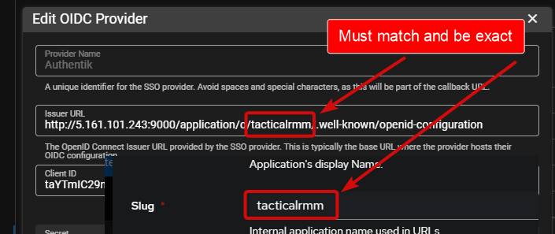


## Security

When using SSO, the security of your application depends on the configuration of your chosen authentication provider. While local TRMM accounts enforce mandatory 2FA for enhanced security, SSO providers may not require 2FA by default. To maintain strong security, ensure that your SSO provider is configured with 2FA or equivalent measures to protect user accounts.


For those who have no interest in using this feature and want it completely disabled, SSO can be disabled at the filesystem level, which will override the setting in Global Settings in the web interface.

???+ note "Disable SSO at the filesystem level"

    === ":material-ubuntu: Standard install"
		Append the following variable to `/rmm/api/tacticalrmm/tacticalrmm/local_settings.py`
        ```py
		TRMM_DISABLE_SSO = True
		```

		Restart the following services: `sudo systemctl restart rmm daphne`

    === ":material-docker: Docker install"
		Add `TRMM_DISABLE_SSO=True` to your `.env` file and run ```docker compose down && docker compose up -d ```


## How do I activate SSO as a new sponsor?

*Ignore the following if you're an existing sponsor upgrading from a version below 0.20.0, as SSO will automatically be activated for you during the upgrade process.*

1. Make sure your server has an appropriate [code signing](../../code_signing.md) token saved ( Settings > Code Signing).

2. Run the update script with the `--force` flag (see instructions below for standard vs docker installs):

3. [Hard reload](https://help.codehs.com/en/articles/4951972-how-to-clear-your-browser-cache-and-hard-refresh) the web page. Make sure you use your browser's reload button to hard reload the page.

???+ note ""

	=== ":material-ubuntu: Standard install"

		```bash
		cd ~
		wget -N https://raw.githubusercontent.com/amidaware/tacticalrmm/master/update.sh
		chmod +x update.sh
		./update.sh --force
		```

	=== ":material-docker: Docker install"

		```bash
		docker compose down
		docker compose up -d
		```

For any issues with activating SSO, [open a ticket](https://support.amidaware.com).