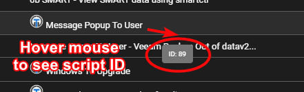

## API Access

Tactical RMM uses a Django Rest Framework backend which is designed to be consumed by a [VueJS frontend](https://github.com/amidaware/tacticalrmm-web).

Therefore, anything you can do via the web interface, you can do via the API.

However this makes it difficult to document the API as it has only been designed to be consumed by our vue frontend.

The easiest way to see what endpoint/payload you need to send is to open your browser's developer tools > Network tab. Then, perform the action you wish to do via the api in Tactical's web interface and watch the network tab to see the endpoint and the payload that is generated, and use that as an example of how to structure your api request.

Please note that using an API key will bypass 2FA authentication.

Please note that Tactical RMM, rigorously battle-tested and proven for production readiness, adheres to [Semantic Versioning](https://semver.org/). However, as we have not reached a 1.0.0 release, be advised that the API is still evolving and may experience breaking changes.

When creating the key you'll need to choose a user, which will reflect what permissions the key has based on the user's role.

Navigate to **Settings > Global Settings > API Keys** to generate a key.

!!!warning
    Pay attention to your trailing `/` they matter.

Headers:

```json
{
    "Content-Type": "application/json",
    "X-API-KEY": "J57BXCFDA2WBCXH0XTELBR5KAI69CNCZ"
}
```

Example curl request:

```bash
curl https://api.example.com/clients/ -H "X-API-KEY: Y57BXCFAA9WBCXH0XTEL6R5KAK69CNCZ"
```

## Enable Swagger

This will let you add a browser interface to see how you can use the API better.

Open `/rmm/api/tacticalrmm/tacticalrmm/local_settings.py` and add

```conf
SWAGGER_ENABLED = True
```

Restart Django: `sudo systemctl restart rmm.service`

Then visit `https://api.example.com/api/schema/swagger-ui/` to see it in action.

## Beta API
*Version added: Tactical RMM v0.16.5*

A beta API is now available at `/beta/v1` which supports filtering and pagination.

To activate it, first enable swagger (see above) and then add the following line to `/rmm/api/tacticalrmm/tacticalrmm/local_settings.py`:
```conf
BETA_API_ENABLED = True
```

Then restart Django with: `sudo systemctl restart rmm.service` and check Swagger for usage.

## Querying the API

Here are some examples:

???+ abstract "Example Code"

    === ":fontawesome-brands-python: Python"

        Requests Windows Update check to run against agent ID

        ```python
        import requests

        API = "http://api.example.com"
        HEADERS = {
            "Content-Type": "application/json",
            "X-API-KEY": "DKNRPTHSAPCKT8A36MCAMNZREWWWFPWI",
        }


        def trigger_update_scan():
            agents = requests.get(f"{API}/agents/?detail=false", headers=HEADERS)
            for agent in agents.json():
                r = requests.post(f"{API}/winupdate/{agent['agent_id']}/scan/", headers=HEADERS)
                print(r.json())


        if __name__ == "__main__":
            trigger_update_scan()
        ```

    === ":material-powershell: PowerShell 1"

        ```powershell
        # Example - Get all agents using API

        $headers = @{
            'X-API-KEY' = 'ABC1234567890987654321'
        }

        $url = "https://api.yourdomain.com/agents/"

        $agentsResult = Invoke-RestMethod -Method 'Get' -Uri $url -Headers $headers -ContentType "application/json"

        foreach ($agent in $agentsResult) {
            Write-Host $agent

            #Write-Host $agent.hostname
        }
        ```

    === ":material-powershell: PowerShell 2"

        ```powershell
        # Example - Send PowerShell command to agent.  Make sure to pass {{agent.agent_id}} as a parameter

        param(
            $AgentId
        )

        $headers = @{
            'X-API-KEY' = 'ABC1234567890987654321'
        }

        $url = "https://api.yourdomain.com/agents/$AgentId/cmd/"

        $body = @{
            "shell"   = "powershell"
            "cmd"     = "dir c:\\users"
            "timeout" = 30
        }

        $commandResult = Invoke-RestMethod -Method 'Post' -Uri $url -Body ($body|ConvertTo-Json) -Headers $headers -ContentType "application/json"

        Write-Host $commandResult
        ```

### Running a Script on an Agent Using the API

First get the script ID from the Script library by hovering your mouse over it in the script list and looking at the tooltip.



`POST` to the endpoint `/agents/<agentid>/runscript/` this:

```
{
    "output": "forget",
    "emails": [],
    "emailMode": "default",
    "custom_field": null,
    "save_all_output": false,
    "script": 89, // primary key of script in postgres
    "args": [
        "arg1",
        "arg2"
    ],
    "env_vars": [],
    "run_as_user": false,
    "timeout": 90 // seconds
}
```

???+ abstract "Example: Run a script on an agent"

    === ":material-powershell: PowerShell"

        ```powershell
        $apiUrl = 'https://api.example.com/agents/CHANGEME/runscript/'

        $jsonPayload = @{
            output = "wait"
            emails = @()
            emailMode = "default"
            custom_field = $null
            save_all_output = $false
            script = 89
            args = @()
            env_vars = @()
            run_as_user = $false
            timeout = 90
        } | ConvertTo-Json


        $headers = @{
            'Content-Type' = 'application/json'
            'X-API-KEY' = 'changeme'
        }

        $response = Invoke-RestMethod -Uri $apiUrl -Method Post -Body $jsonPayload -Headers $headers
        $response
        ```

## API via CLI

<https://gitlab.com/NiceGuyIT/trmm-cli>

# API Examples

## Listing all software on all agents:

```python
import requests

API = "https://api.example.com"
HEADERS = {
    "Content-Type": "application/json",
    "X-API-KEY": "9SI43IFUMPEVRWOZR4NC8PGP4ZLA9PYX",
}

def get_software():
    agents = requests.get(f"{API}/agents/?detail=false", headers=HEADERS)  # get a list of all agents
    for agent in agents.json():  # loop thru all agents and print list of installed software
        r = requests.get(f"{API}/software/{agent['agent_id']}/", headers=HEADERS)
        print(r.json())

if __name__ == "__main__":
    get_software()
```

## List Agents

```powershell
# Query the TRMM API with PowerShell
. .\dotenv.ps1

$Agents_Endpoint = GetURL("agents")
$Agents = Invoke-RestMethod $Agents_Endpoint -Headers $Headers -ContentType "application/json" -Method "Get"
# $Agents | ConvertTo-Json
$Agents.foreach({ $_ }) | Select-Object Agent_ID, Hostname, Site_Name, Client_Name, Monitoring_Type | Format-Table
```

## List Tasks


```powershell
# Query the TRMM API with PowerShell
. .\dotenv.ps1

$Tasks_Endpoint = GetURL("tasks")
$Response = Invoke-RestMethod $Tasks_Endpoint -Headers $Headers -ContentType "application/json" -Method "Get"
# $Response | ConvertTo-Json
$Response.foreach({ $_ }) | Select-Object ID, Policy, Name, Custom_Field | Format-Table
```

## Get Custom Fields

```powershell
$TRMM_API_Base_Endpoint = Read-Host "Please provide your API domain i.e https://api.domain.com"
$TRMM_API_Key = Read-Host "Please provide your API Key"

$TRMM_API_CustomFields_Endpoint = $TRMM_API_Base_Endpoint + "/core/customfields"

$TRMM_Request_Headers = @{

    "X-API-KEY" = $TRMM_API_Key

}

$Request = Invoke-RestMethod $TRMM_API_CustomFields_Endpoint -Headers $TRMM_Request_Headers -Method Get

$TRMM_Agent_ExistingCustomFields = ($Request | ? {$_.model -eq 'Agent'})

# Gets all of the Windows Features and places it in an array to parse later
# This is to ensure that TRMM has all Windows Feature roles available as a Custom Field
$AllWindowsFeatures = Get-WindowsFeature
$TRMM_Role_AllCustomFields = @()

foreach($WindowsFeature in $AllWindowsFeatures){

    if($WindowsFeature.Depth -eq 1){

        $PrimaryRole = $WindowsFeature.DisplayName

    } else {

        $TRMM_Role_AllCustomFields += [PSCustomObject]@{

            "Role" = $PrimaryRole
            "Value" = $WindowsFeature.DisplayName

        }

    }

}

$Unique_Roles = $TRMM_Role_AllCustomFields | Select -Unique Role
#Loop through each WindowsFeature
foreach($WindowsFeature in $Unique_Roles){

    if($TRMM_Agent_ExistingCustomFields.Name -like "*$($WindowsFeature.Role)*"){

        # Need to check if it also contains the value

    } else {

        # Check to see if the Role is an Array or an Object
        # Convert to Array otherwise

        if((($TRMM_Role_AllCustomFields | ? {$_.Role -eq $WindowsFeature.Role}).Value) -isnot [array]){

            $CustomFieldOptions = @(($TRMM_Role_AllCustomFields | ? {$_.Role -eq $WindowsFeature.Role}).Value)

        } else {

            $CustomFieldOptions = ($TRMM_Role_AllCustomFields | ? {$_.Role -eq $WindowsFeature.Role}).Value

        }

        # Create the Custom Field body
        $CustomFieldData = @{

            model = "agent"
            name = "Server Role - " + $WindowsFeature.Role
            type = "multiple"
            options = $CustomFieldOptions

        }

        $CreateCustomField = Invoke-RestMethod $TRMM_API_CustomFields_Endpoint -Headers $TRMM_Request_Headers -Method Post -Body ($CustomFieldData | ConvertTo-Json) -ContentType "application/json"

    }
}
```

## Get Custom Fields

<https://discord.com/channels/736478043522072608/888474369544847430/1004184193078669522>

```python
import requests
import json

API = "https://api.example.com"
HEADERS = {
    "Content-Type": "application/json",
    "X-API-KEY": "changeme",
}

payload = {"custom_fields": [{"string_value": "66666", "field": 2}]}

r = requests.put(
    f"{API}/agents/IcAhWvOHlADwjuYmndAkjbJuhSdWvWjtvYcYjCZk/",
    data=json.dumps(payload),
    headers=HEADERS,
)

print(r.__dict__)
```

## Create Collector Tasks

<https://discord.com/channels/736478043522072608/888474369544847430/1004383584070676610>

```powershell
# Query the TRMM API with PowerShell

# Add this to dotenv.ps1
#$TRMM_API_KEY = ""
#$TRMM_API_DOMAIN = ""
. .\dotenv.ps1

function GetURL {
    param (
        [string] $Path
    )
    return "https://${TRMM_API_DOMAIN}/${Path}/"
}

$Headers = @{
    'X-API-KEY' = $TRMM_API_KEY
}

$Collector = [PSCustomObject]@{
    policy = 1
    actions = @(@{
        name = "Collector - Location - City and State"
        type = "script"
        script = 121
        timeout = 90
        script_args = @()
    })
    assigned_check = $null
    custom_field = 14
    name = "Get city and state from API"
    # expire_date = $null
    run_time_date = "2022-08-02T08:00:00Z"
    # run_time_bit_weekdays = $null
    weekly_interval = 1
    daily_interval = 1
    # monthly_months_of_year = $null
    # monthly_days_of_month = $null
    # monthly_weeks_of_month = $null
    # task_instance_policy = 0
    # task_repetition_interval = $null
    # task_repetition_duration = $null
    # stop_task_at_duration_end = $false
    # random_task_delay = $null
    # remove_if_not_scheduled = $false
    run_asap_after_missed = $true
    task_type = "daily"
    alert_severity = "info"
    # collector_all_output = $false
    # continue_on_error = $false
}

$Tasks_Endpoint = GetURL("tasks")
$Payload = $Collector | ConvertTo-Json
$Response = Invoke-RestMethod $Tasks_Endpoint -Headers $Headers -ContentType "application/json" -Method "Post" -Body $Payload
if (! $?) {
    Write-Output "Failed to submit request: $($error[0].ToString() )"
    Write-Output "Stacktrace: $($error[0].Exception.ToString() )"
    Exit(1)
}
$Response | ConvertTo-Json
```

## Show Tasks

```powershell
# Query the TRMM API with PowerShell
. .\dotenv.ps1

$Tasks_Endpoint = GetURL("tasks")
$Response = Invoke-RestMethod $Tasks_Endpoint -Headers $Headers -ContentType "application/json" -Method "Get"
# $Response | ConvertTo-Json
$Response.foreach({ $_ }) | Select-Object ID, Policy, Name, Custom_Field | Format-Table
```

## Show Task/collector results

```powershell
# Query the TRMM API with PowerShell
. .\dotenv.ps1

$Agents_Endpoint = GetURL("agents")
$Agents = Invoke-RestMethod $Agents_Endpoint -Headers $Headers -ContentType "application/json" -Method "Get"
# $Agents | ConvertTo-Json
# $Agents.foreach({ $_ }) | Select-Object Agent_ID, Hostname, Site_Name, Client_Name, Monitoring_Type | Format-Table
$Agent_ID = "AGENT ID FROM TABLE"

$Agents.foreach({
    if ($_.Agent_ID -ne $Agent_ID) {
        return
    }
    $Fields_Endpoint = GetURL("agents/$($_.Agent_ID)/tasks")
    $Fields = Invoke-RestMethod $Fields_Endpoint -Headers $Headers -ContentType "application/json" -Method "Get"
    # $Fields | ConvertTo-Json
    $Fields.foreach({ $_ }) | Select-Object ID, Check_Name, Name, Actions, Task_Result | Format-Table
})
```

or to see results

```powershell
# Query the TRMM API with PowerShell
. .\dotenv.ps1

$Agents_Endpoint = GetURL("agents")
$Agents = Invoke-RestMethod $Agents_Endpoint -Headers $Headers -ContentType "application/json" -Method "Get"
# $Agents | ConvertTo-Json
# $Agents.foreach({ $_ }) | Select-Object Agent_ID, Hostname, Site_Name, Client_Name, Monitoring_Type | Format-Table
$Agent_ID = "AGENT ID FROM TABLE"

$Agents.foreach({
    if ($_.Agent_ID -ne $Agent_ID) {
        return
    }
    $Fields_Endpoint = GetURL("agents/$($_.Agent_ID)/tasks")
    $Fields = Invoke-RestMethod $Fields_Endpoint -Headers $Headers -ContentType "application/json" -Method "Get"
    # $Fields | ConvertTo-Json
    $Fields.foreach({
        $_.Task_Result | Format-Table
     })
})
```

## List Custom Fields of Agent

```powershell
# Query the TRMM API with PowerShell
. .\dotenv.ps1

$Agent_ID = "ENTER AGENT ID HERE"
$Agents_Endpoint = GetURL("agents/$($Agent_ID)")
$Agents = Invoke-RestMethod $Agents_Endpoint -Headers $Headers -ContentType "application/json" -Method "Get"
ConvertTo-Json $Agents.Custom_Fields
$Agents.Custom_Fields
```

## Update Custom Fields

<https://discord.com/channels/736478043522072608/888474369544847430/1004422340815360111>

This will update the custom fields for an agent. The field value come from the custom fields two posts above. Other fields that exist will not be updated. If you want to update only 1 custom field, use only 1 entry in the array.

```powershell
# Query the TRMM API with PowerShell
. .\dotenv.ps1

$Agent_ID = "AGENT ID GOES HERE"
$Endpoint = GetURL("agents/$($Agent_ID)")

$Custom_Fields = [PSCustomObject]@{
    custom_fields = @(
        @{
            field = 13
            string_value = "Value updated from the API"
        },
        @{
            field = 14
            string_value = "Another value from the API"
        }
    )
}

$Payload = $Custom_Fields | ConvertTo-Json
$Response = Invoke-RestMethod $Endpoint -Headers $Headers -ContentType "application/json" -Method Put -Body $Payload
if (! $?) {
    Write-Output "Failed to submit request: $($error[0].ToString() )"
    Write-Output "Stacktrace: $($error[0].Exception.ToString() )"
    Exit(1)
}
$Response | ConvertTo-Json
```

## List service information from Agent

```powershell
# Query the TRMM API with PowerShell
. .\dotenv.ps1

$Payload = [PSCustomObject]@{
    code = [string](Get-Content -Path .\TRMM-Run-Cmd-Remote.ps1 -Raw -Encoding UTF8)
    timeout = 90
    args = @()
    shell = "powershell"
}

$Agent_ID = "ENTER AGENT ID HERE"
$Rest_Params = @{
    Uri = GetURL("scripts/${Agent_ID}/test")
    Headers = $Headers
    ContentType = "application/json"
    Method = "POST"
    Body = $Payload | ConvertTo-Json
}
# Write-Output $Rest_Params["Body"]

# Prefer to handle the error ourselves rather than fill the screen with red text.
$ErrorActionPreference = 'SilentlyContinue'

$Response = Invoke-RestMethod @Rest_Params
if (! $?) {
    Write-Output "Failed to submit request: $($error[0].ToString() )"
    Write-Output "Stacktrace: $($error[0].Exception.ToString() )"
    Exit(1)
}
# $Response | ConvertTo-Json
$Services = [System.Text.Encoding]::UTF8.GetString([System.Convert]::FromBase64String($Response))
ConvertFrom-Json $Services
```

## Combining scripts

This will iterate over all agents, filter out non-Windows and offline agents, run the PowerShell above to the first 5 services that are running, and compile the information in a Servers array.

```powershell
# Query the TRMM API with PowerShell
. .\dotenv.ps1

# Default parameters. Body is missing because GET does not include the body.
$Rest_Params = @{
    Uri = ""
    Headers = $Headers
    ContentType = "application/json"
    Method = "GET"
}

# Prefer to handle the error ourselves rather than fill the screen with red text.
$ErrorActionPreference = 'SilentlyContinue'

$Rest_Params["Uri"] = GetURL("agents")
$Agents = Invoke-RestMethod @Rest_Params
if (! $?) {
    Write-Output "Failed to get list of agents from API: $($error[0].ToString() )"
    Write-Output "Stacktrace: $($error[0].Exception.ToString() )"
    Exit(1)
}

# Remote command to run.
$Payload = [PSCustomObject]@{
    # Without the type casting to [string], this was returning properties relating to Get-Content.
    code = [string](Get-Content -Path .\TRMM-Run-Cmd-Remote.ps1 -Raw -Encoding UTF8)
    timeout = 90
    args = @()
    shell = "powershell"
}

$Rest_Params["Body"] = [string]($Payload | ConvertTo-Json)
$Rest_Params["Method"] = "POST"
$Servers = @()
foreach($Agent in $Agents) {
    # Build this object to match your needs.
    $Server = [PSCustomObject]@{
        Agent_ID = $Agent.agent_id
        # Services = "Error / Unavailable"
        Service_Name = "N/A"
        Service_Status = "N/A"
        Service_DisplayName = "N/A"
        Hostname = $Agent.hostname
        Platform = $Agent.plat
        Status = $Agent.status
    }

    if ($Agent.plat -ne "windows" -or $Agent.status -ne "online") {
        # Only process online Windows agents. Add other checks as necessary.
        # Uncomment this if you want to include filtered servers in the output.
        # $Servers += $Server.PSObject.Copy()
        continue
    }

    $Rest_Params["Uri"] = GetURL("scripts/$($Agent.Agent_ID)/test")
    $Response = Invoke-RestMethod @Rest_Params
    if (! $?) {
        $Servers += $Server.PSObject.Copy()
        continue
    }

    # Create a new server object for every item returned from the remote agent (Services in this case).
    $Services = ConvertFrom-Json ([System.Text.Encoding]::UTF8.GetString([System.Convert]::FromBase64String($Response)))
    foreach($Service in $Services) {
        $Server.Service_Name = $Service.Name
        $Server.Service_Status = $Service.Status
        $Server.Service_DisplayName = $Service.DisplayName
        $Servers += $Server.PSObject.Copy()
    }
}

$Servers | Format-Table Agent_ID, Hostname, Status, Service_Name, Service_Status, Service_DisplayName
# $Servers
```

## Pulling Audit Logs

```php
<?php
$ApiKey = "XXX";
$BasicUrl = "https://api.trmm.xxx.xxx/";
$Url = "/logs/audit/";
$curl = curl_init();

curl_setopt($curl, CURLOPT_URL, $BasicUrl.$Url);

$payload = '{"pagination":{"sortBy":"entry_time","descending":true,"page":1,"rowsPerPage":1000,"rowsNumber":2},"agentFilter":["QFhdnzJcFnodMibCGJYmfIwRyjgIazjajjMSvVWX"],"actionFilter":["modify"]}';
curl_setopt($curl, CURLOPT_POSTFIELDS, $payload);

curl_setopt($curl, CURLOPT_RETURNTRANSFER, true);

$headers = ['Content-Type: application/json', 'X-API-KEY: '.$ApiKey];
curl_setopt($curl, CURLOPT_HTTPHEADER, $headers);

curl_setopt($curl, CURLOPT_CUSTOMREQUEST, 'PATCH');

$data = curl_exec($curl);

curl_close($curl);

$audit = json_decode($data, true);

var_dump($audit);

?>
```

## Update software using API

```python
#!/rmm/api/env/bin/python

import concurrent.futures
import requests

API = "https://api.CHANGEME.com"
API_KEY = "CHANGEME"

HEADERS = {
    "Content-Type": "application/json",
    "X-API-KEY": API_KEY,
}

MAX_WORKERS = 10


def create_list_of_urls():
    ret = []
    agents = requests.get(f"{API}/agents/?detail=false", headers=HEADERS)
    for agent in agents.json():
        ret.append(f"{API}/software/{agent['agent_id']}/")  # refresh software endpoint

    return ret


def do_software_refresh(url):
    r = requests.put(url, headers=HEADERS)
    return r.json()


with concurrent.futures.ThreadPoolExecutor(max_workers=MAX_WORKERS) as executor:
    futures = []
    for url in create_list_of_urls():
        futures.append(executor.submit(do_software_refresh, url))

    for future in concurrent.futures.as_completed(futures):
        print(future.result())
```
