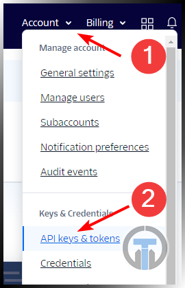

# Email and SMS Setup

## Email Setup

Under **Settings > Global Settings > Email Alerts**

### Setting up Tactical RMM Alerts using Open Relay

MS 365 in this example

1. Log into Tactical RMM
2. Go to Settings
3. Go to Global Settings
4. Click on Alerts
5. Enter the email address (or addresses) you want to receive alerts to eg info@EXAMPLE.COM
6. Enter the from email address (this will need to be part of your domain on 365, however it doesn’t need a license) eg rmm@EXAMPLE.COM
7. Go to MXToolbox.com and enter your domain name in, copy the hostname from there and paste into Host
8. Change the port to 25
9. Click Save
10. Login to admin.microsoft.com
11. Go to Exchange Admin Centre
12. Go to “Connectors” under “Mail Flow”
13. Click to + button
14. In From: select “Your organizations email server”
15. In To: select “Office 365”
16. Click Next
17. In the Name type in RMM
18. Click By Verifying that the IP address……
19. Click +
20. Enter your IP and Click OK
21. Click Next
22. Click OK

### Setting up Tactical RMM Alerts using username & password

Gmail in this example

1. Log into Tactical RMM
2. Go to Settings
3. Go to Global Settings
4. Click on Alerts
5. Enter the email address (or addresses) you want to receive alerts to eg info@EXAMPLE.COM
6. Enter the from email address myrmm@gmail.com
7. Tick the box “My server requires Authentication”  
8. Enter your username e.g. myrmm@gmail.com
9. Enter your password
10. Change the port to 587
11. Click Save

### Customizing alert email subjects and bodies

Tactical RMM supports customizable email templates for alert emails directly in
**Settings > Global Settings > Email Alerts**.

You can define custom subject and body templates for:

- Checks
- Tasks
- Agent Offline
- Agent Recovered

If a template field is left blank, Tactical RMM will continue using the built-in
subject or body for that alert type.

The original generated values are still available as template variables:

- `{subject}`
- `{body}`

Depending on the alert type, additional variables are available.

`{agent}`, `{client}`, `{site}`, `{site_id}`, `{policy}`, `{alert_name}`

Section-specific variables are also available, for example:

- Checks: `{check_name}`, `{check_description}`, `{details}`, `{more_info}`,
  `{stdout}`, `{stderr}`, `{retcode}`
- Tasks: `{task_name}`, `{details}`, `{stdout}`, `{stderr}`, `{retcode}`
- Agent offline / recovered: `{details}`, `{alert_status}`, `{last_response}`

`{last_response}` uses the Default Date Format from Global Settings.

Example subject template:

```text
[{client}] {agent} - {alert_name}
```

Example body template:

```text
Alert: {alert_name}
Agent: {agent}
Site ID: {site_id}

{details}
```

Original built-in subject examples:

```text
{client}, {site}, {agent} - {alert_name} Failed
{client}, {site}, {agent} - {alert_name} Resolved
{client}, {site}, {agent} - data overdue
{client}, {site}, {agent} - data received
```

Original built-in body examples:

```text
{client}, {site}, {agent} - {alert_name} Failed - {details}
{client}, {site}, {agent} - {alert_name} Resolved - {details}
Data has not been received from client {client}, site {site}, agent {agent} within the expected time.
Data has been received from client {client}, site {site}, agent {agent} after an interruption in data transmission.
```

## SMS Alerts

Under **Settings > Global Settings > SMS Alerts**

Currently Twilio is the only support SMS service

Setup an Auth Token, and copy the data to the relevant fields


