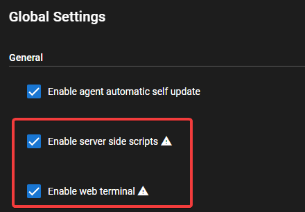

# User Roles and Permissions

## Permission Manager

Make sure you've setup at least 1 valid (Super User aka Administrator) role under _Settings > Permission Manager_

1. Login as usual Tactical user
2. Go to Settings - Permissions Manager
3. Click New Role
4. You can all the role anything, I called it Admins
5. Tick the Super User Box/or relevant permissions required
6. Click Save then exit Permissions Manager
7. Go to Settings - Users
8. Open current logged in user/or any other user and assign role (created above step 6) in the Role drop down box.
9. Click Save 

Once you've set that up a Super User role and assigned your primary user, you can create other Roles with more limited access.

!!!tip
    If you are only trying to give permissions to one or more sites within a client, but not all of the sites, then leave the "Allowed Clients" field blank and only add sites to "Allowed Sites". If a client is set in "Allowed Clients" that will override any site perms and give access to all sites within that client, regardless of what sites are set.

## Video Walkthru

<div class="video-wrapper">
  <iframe width="400" height="225" src="https://www.youtube.com/embed/TTPLvgjMgp0" frameborder="0" allowfullscreen></iframe>
</div>

## Permissions with extra Security implications

!!!warning
    **DO NOT** use the Web Terminal for running the Tactical [update]() script as it will stop the service running the web terminal and bork your update.

* Use TRMM Server Web Terminal
* Run Scripts on TRMM Server

Both of these functions are running under the linux user that you installed TRMM with (usually `tactical` if you followed the docs).

These have full access to your TRMM server's filesystem and as a result have the ability to become root if you have passwordless sudo enabled.

These can be very dangerous features if not handled with care so think carefully before you enable/use them.

These features can be disabled from the web UI in Global Settings.



They can also be disabled at the filesystem level (which overrides the setting in Global Settings) by adding any of these variables to `/rmm/api/tacticalrmm/tacticalrmm/local_settings.py`

```py
TRMM_DISABLE_WEB_TERMINAL = True
TRMM_DISABLE_SERVER_SCRIPTS = True
```

After adding these make sure they take effect by running `sudo systemctl restart rmm daphne celery celerybeat`

!!!warning
    **Docker Installs** need only update the .env file for the variables to take effect.
