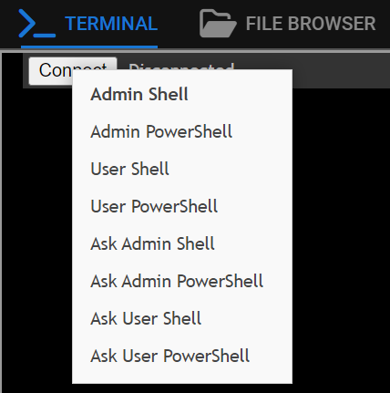
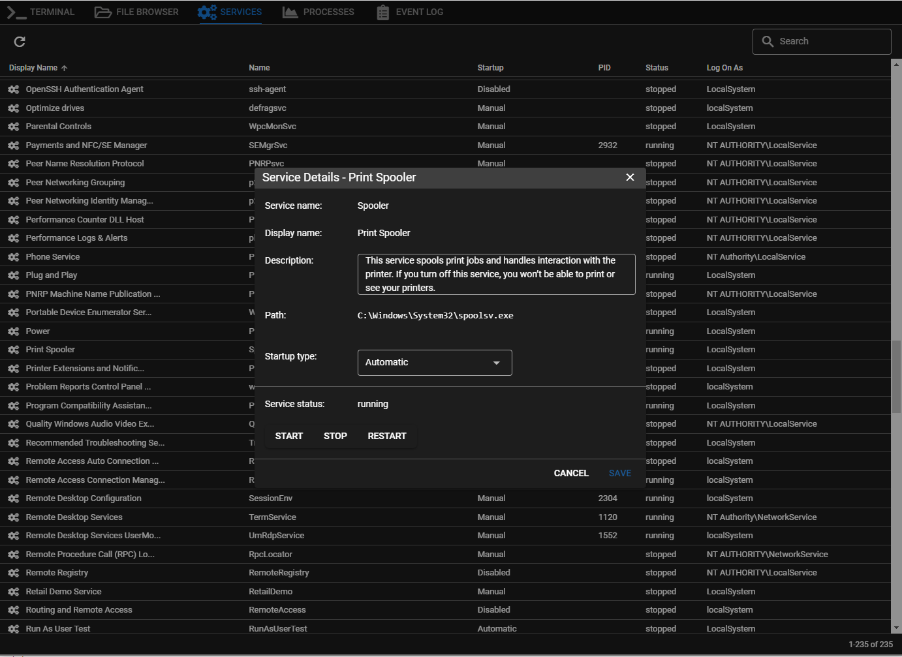
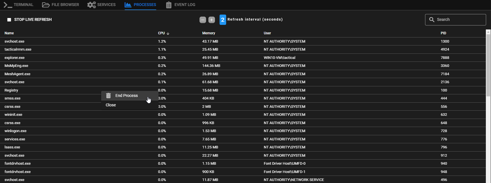
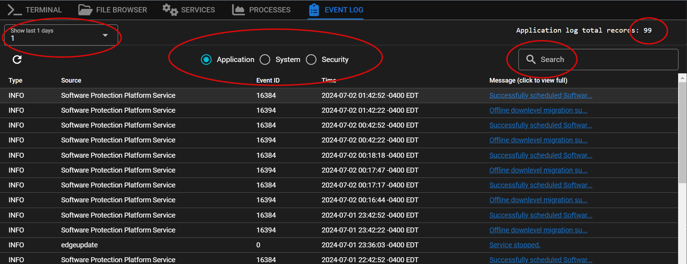

# Remote Background

To access: **Right click** on an agent > **Remote Background**

## Terminal Tab

Meshcentral Integration: This will allow you to open a terminal on the remote agent. 

Right-clicking will allow:

- Admin Shell
- Admin PowerShell
- User Shell
- User PowerShell
- Ask Admin Shell
- Ask Admin PowerShell
- Ask User Shell
- Ask User PowerShell

!!!tip
    If you don't see any Connect button in the top left the problem is either the TRMM user doesn't have meshcentral permissions or the mesh agent is having connectivity problems. Try either the "Recover Connection" button or script "TacticalRMM - Check Mesh Agent for problems"

## File Browser

Meshcentral Integration: This will allow you to open a File Manager where you can manage and transfer files to and from the agent.

## Services Tab

Right click on a service to show the context menu where you can start/stop/restart services:

Click *Service Details* to bring up the details tab where you can edit more service options:

## Processes Tab

A very basic task manager that shows real time process usage.

**Right click** on a process to end the task:

## Event Log

Allows you to query the Windows Application | System | Security Logs

