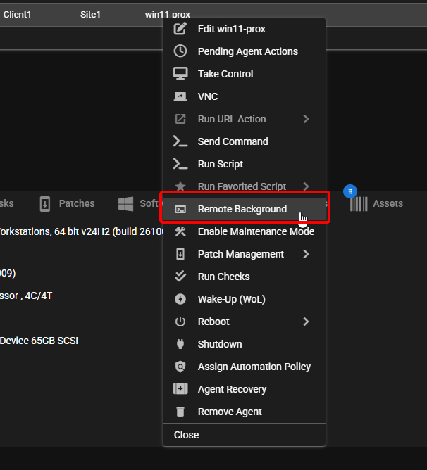
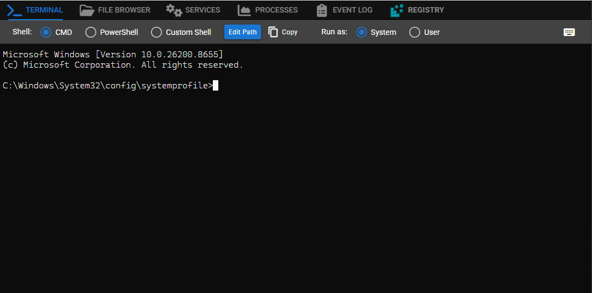
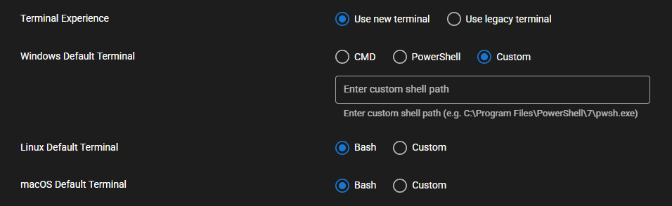
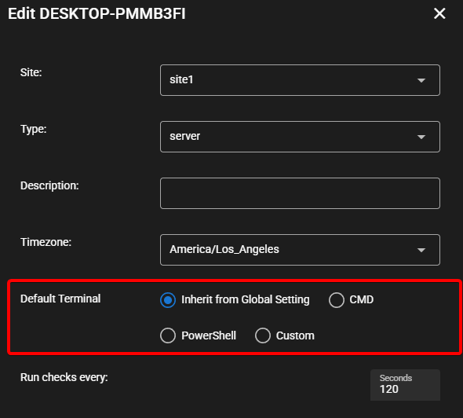
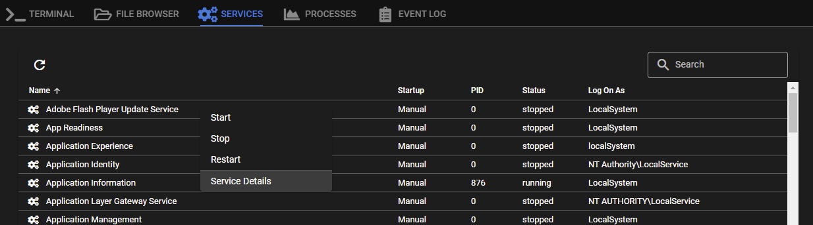
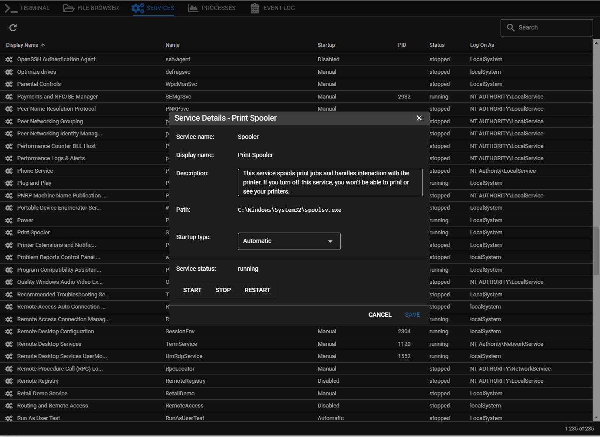
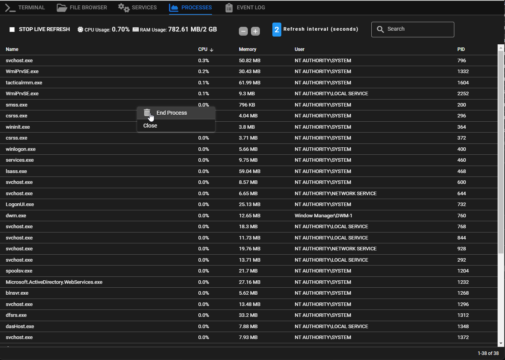
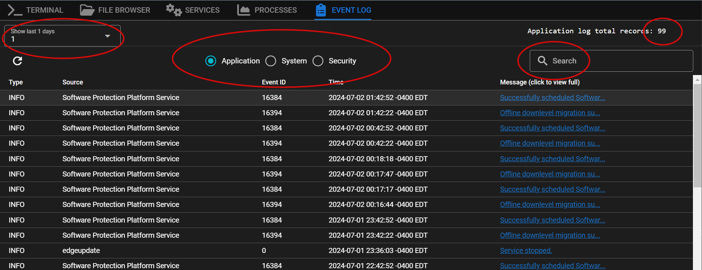

# Remote Background

To access: **Right click** on an agent > **Remote Background**:

## Terminal Tab

This allows you to open a terminal on the remote agent.

- Windows: CMD, PowerShell, or a custom shell specified by full path (e.g. C:\Program Files\PowerShell\7\pwsh.exe)
- Linux: Bash or a custom shell (e.g. /usr/bin/fish)
- macOS: zsh/bash or a custom shell (e.g. /bin/zsh)

Global shell defaults can be configured under *Global Settings > General*, applied to all agents:

Individual agents inherit the global default but can be overridden under the agent's edit settings, allowing a different shell per agent:

Terminal access is controlled by the *Use Terminal* permission.

## File Browser

Meshcentral Integration: This will allow you to open a File Manager where you can manage and transfer files to and from the agent.

## Services Tab

Right click on a service to show the context menu where you can start/stop/restart services:

Click *Service Details* to bring up the details tab where you can edit more service options:

## Processes Tab

A very basic task manager that shows real time process usage.

**Right click** on a process to end the task:

## Event Log

Allows you to query the Windows Application | System | Security Logs

