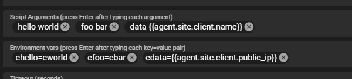

# Scripting

Tactical RMM supports uploading existing scripts or creating new scripts from within the web interface.

Windows agent languages supported:

- PowerShell
- Windows Batch
- Python
- [Nushell](https://www.nushell.sh/)
- [Deno](https://deno.com/)

There is [RunAsUser](../howitallworks.md#runasuser-functionality) functionality for Windows.

Linux/Mac languages supported:

- Any language that is installed on the remote machine (use a shebang at the top of the script to set the interpreter)
- nu
- deno (Javascript and TypeScript)

## Adding Scripts

In the dashboard, browse to **Settings > Scripts Manager**. Click the **New** button and select either Upload Script or New Script. The available options for scripts are:

- **Name** - This identifies the script in the dashboard.
- **Description** - Optional description for the script.
- **Category** - Optional way to group similar scripts together.
- **Type** - This sets the language of the script. Available options are:
    - PowerShell
    - Windows Batch
    - Python
    - Shell (use for Linux/macOS scripts)
    - Nushell
    - Deno

- **Script Arguments** - Optional way to set default arguments for scripts. These will auto populate when running scripts and can be changed at runtime. Logged on Windows Event Viewer > Applications and Services Logs > Microsoft > Windows> PowerShell > Operational
- **Environment vars** - Optional way to set default arguments for scripts using Environment Variables. These will auto populate when running scripts and can be changed at runtime. Not logged, better to use when passing data you don't want logged
- **Default Timeout** - Sets the default timeout of the script and will stop script execution if the duration surpasses the configured timeout. Can be changed at script runtime.
- **Favorite** - Favorites the script.

## Downloading Scripts

To download a Tactical RMM Script, click on the script in the Script Manager to select it. Then click the **Download Script** button on the top. You can also right-click on the script and select download.

## Community Scripts

These are script that are built into Tactical RMM. They are provided and maintained by the [Tactical RMM community](https://github.com/amidaware/community-scripts). These scripts are updated whenever Tactical RMM is updated and can't be modified or deleted in the dashboard.

### Hiding Community Scripts
You can choose to hide community script throughout the dashboard by opening **Script Manager** and clicking the **Show/Hide Community Scripts** toggle button.

## Using Scripts

### Manual run on agent

In the **Agent Table**, you can right-click on an agent and select **Run Script**. You have the options of:

- **Wait for Output** - Runs the script and waits for the script to finish running and displays the output.
- **Fire and Forget** - Starts the script and does not wait for output.
- **Email Output** - Starts the script and will email the output. Allows for using the default email address in the global settings or adding a new email address.
- **Save as Note** - Saves the output as a Note that can be views in the agent Notes tab.
- **Collector** - Saves to output to the specified custom field.

There is also an option on the agent context menu called **Run Favorited Script**. This will pre-populate the script run dialog with the script of your choice.

[Script Execution Process](../howitallworks.md#windows-agent)

### Script Arguments

The `Script Arguments` field should be pre-filled with information for any script that can accept or requires parameters. [Use the (i)](../tipsntricks.md#scripts)

<p style="background-color:#1e1e1e;">
&nbsp;<span style=color:#d4d4d4><</span><span style="color:#358cd6">Required Parameter Name</span><span style=color:#d4d4d4>></span> <span style=color:#d4d4d4><</span><span style="color:#358cd6">string</span><span style=color:#d4d4d4>></span><br>
&nbsp;<span style="color:#ffd70a">[</span><span style=color:#d4d4d4>-<</span><span style="color:#358cd6">Optional Parameter Name</span><span style=color:#d4d4d4>></span> <span style=color:#d4d4d4><</span><span style="color:#358cd6">string</span><span style=color:#d4d4d4>></span><span style="color:#ffd70a">]</span><br>
&nbsp;<span style="color:#ffd70a">[</span><span style=color:#d4d4d4>-<</span><span style="color:#358cd6">string</span><span style=color:#d4d4d4>></span> <span style="color:#c586b6">{</span><span style=color:#87cefa>(</span><span style=color:#d4d4d4><</span><span style="color:#358cd6">default string if not specified</span><span style=color:#d4d4d4>></span><span style=color:#87cefa>)</span> <span style=color:#d4d4d4>|</span> <span style=color:#d4d4d4><</span><span style="color:#358cd6">string2</span><span style=color:#d4d4d4>></span> <span style=color:#d4d4d4>|</span> <span style=color:#d4d4d4><</span><span style="color:#358cd6">string3</span><span style=color:#d4d4d4>></span><span style="color:#c586b6">}</span><span style="color:#ffd70a">]</span></p>

Where `[]` indicates an optional parameter

and `{}` indicates a parameter with several preconfigured parameter

and `()` indicates a default parameter if none is specified.

Starting with 0.15.4 you can use environment variables to pass them too!

#### Examples

Script Arguments

```
-hello world
-foo bar
-data {{agent.public_ip}}
```

Environment vars

```
ehello=eworld
efoo=ebar
edata={{agent.hostname}}
```



=== ":material-language-python: Batch"

    Script

    ```batch
    @echo off
    setlocal

    rem Parameters. Batch only accepts positional params not named ones
    set hello=%1
    set foo=%2
    set data=%3

    echo Script Args
    echo hello: %hello%
    echo foo: %foo%
    echo data: %data%

    echo.
    echo Environment Vars
    echo ehello: %ehello%
    echo efoo: %efoo%
    echo edata: %edata%

    endlocal
    ```

=== ":material-powershell: Powershell"

    Script

    ```ps
    param(
        [string]$hello,
        [string]$foo,
        [string]$data
    )

    Write-Output "Script Args"
    Write-Output "hello: $hello"
    Write-Output "foo: $foo"
    Write-Output "data: $data"

    Write-Output ""
    Write-Output "Environment Vars"
    Write-Output "ehello: $env:ehello"
    Write-Output "efoo: $env:efoo"
    Write-Output "edata: $env:edata"
    ```

=== ":material-language-python: Python"

    Script

    ```python
    #!/usr/bin/python3

    import os
    import argparse

    #Note: named args in python require -- and = between name and value eg 
    # --hello=world 
    # --foo=bar
    # --data={{agent.public_ip}}
    # Parse command-line arguments
    parser = argparse.ArgumentParser(description="Process some strings.")
    parser.add_argument("--hello", type=str, help="Value for hello")
    parser.add_argument("--foo", type=str, help="Value for foo")
    parser.add_argument("--data", type=str, help="Value for data")

    args = parser.parse_args()

    # Script Args
    print("Script Args")
    print(f"hello: {args.hello}")
    print(f"foo: {args.foo}")
    print(f"data: {args.data}")

    # Environment Vars
    print("\nEnvironment Vars")
    print(f"ehello: {os.getenv('ehello')}")
    print(f"efoo: {os.getenv('efoo')}")
    print(f"edata: {os.getenv('edata')}")
    ```

=== ":material-bash: Shell"

    Script

    ```bash
    #!/bin/bash

    #Bash only accepts positional params not named ones
    hello="$1"
    foo="$2"
    data="$3"

    echo "Script Args"
    echo "hello: $hello"
    echo "foo: $foo"
    echo "data: $data"

    echo ""
    echo "Environment Vars"
    echo "ehello: $ehello"
    echo "efoo: $efoo"
    echo "edata: $edata"
    ```

<div class="video-wrapper">
  <iframe width="400" height="225" src="https://www.youtube.com/embed/YrnN11XPot8" frameborder="0" allowfullscreen></iframe>
  <iframe width="400" height="225" src="https://www.youtube.com/embed/jLpfN2SOD1U" frameborder="0" allowfullscreen></iframe>
</div>


### Run Script on many agents at once

Under the `Tools menu` -> `Bulk Script` you can execute scripts against Clients/Sites/Selected Agents/All based on All/Servers/Workstations. The history is saved in the history tab of the agent. The history can also be retrieved from the API from the `/agents/history/` endpoint.

### Run Command on many agents at once

Under the `Tools menu` -> `Bulk Command` you can execute a command against Clients/Sites/Selected Agents/All based on All/Servers/Workstations. The history is saved in the history tab of the agent. The history can also be retrieved from the API from the `/agents/history/` endpoint.

### Automated Tasks

Tactical RMM allows scheduling tasks to run on agents. This leverages the Windows Task Scheduler and has the same scheduling options.

See [Automated Tasks](automated_tasks.md) for configuring automated tasks.

### Script Checks

Scripts can also be run periodically on an agent and trigger an alert if it fails in case you want any kind of warning code to alert you.

Important: When utilizing PowerShell scripts and manually assigning an exit code, it's essential to define the exit code using the following syntax: `$host.SetShouldExit(EXITCODE)`. Here, EXITCODE represents the desired exit code number. For instance, to assign an exit code of 3, use `$host.SetShouldExit(3)`.

### Alert Failure/Resolve Actions

Scripts can be triggered when an alert is triggered and resolved.

For configuring **Alert Templates**, see [Alerting](./alerting.md)

See below for populating dashboard data in scripts and the available options.

## Using dashboard data in scripts

Tactical RMM allows passing in dashboard data to scripts as arguments. The below PowerShell arguments will get the client name of the agent and also the agent's public IP address.

```
-ClientName {{client.name}} -PublicIP {{agent.public_ip}}
```

!!!info
    Everything between {{}} is CaSe sEnSiTive

See a full list of possible built-in variables [Here](../script_variables.md)

### Getting Custom Field values

Tactical RMM supports pulling data from custom fields using the {{model.custom_field_name}} syntax.

See [Using Custom Fields in Scripts](custom_fields.md#Using Custom Fields in Scripts).

### Getting values from the Global Keystore

Tactical RMM supports getting values from the global key store using the {{global.key_name}} syntax.

See [Global Keystore](keystore.md).

## Script Snippets

Script Snippets allow you to create common code blocks or comments and apply them to all of your scripts. This could be initialization code, common error checking, or even code comments.

### Adding Script Snippets

In the dashboard, browse to **Settings > Scripts Manager**. Click the **Script Snippets** button.

- **Name** - This identifies the script snippet in the dashboard
- **Description** - Optional description for the script snippet
- **Shell** - This sets the language of the script. Available options are:
    - PowerShell
    - Windows Batch
    - Python

### Using Script Snippets

When editing a script, you can add template tags to the script body that contains the script snippet name. For example, if a script snippet exists with the name "Check WMF", you would put {{Check WMF}} in the script body and the snippet code will be replaced.

!!!info
    Everything between {{}} is CaSe sEnSiTive

The template tags will only be visible when Editing the script. When downloading or viewing the script code the template tags will be replaced with the script snippet code.

### PowerShell 7

<https://docs.microsoft.com/en-us/powershell/module/microsoft.powershell.management/start-process?view=powershell-7.2>

Shell Type: PowerShell

Command: `Start-Process nohup 'pwsh -noprofile -c "1..120 | % { Write-Host . -NoNewline; sleep 1 }"'`

## Python

### Python on windows
Tactical ships with a portable python distribution on windows.

| OS | Version |
| --- | --- |
| Windows >= 8.1 | 3.11.9 |
| Windows < 8.1 | 3.8.7 |

The following 3rd party packages are also bundled with this distribution:

- [cryptography][]
- [httpx][]
- [msgpack][]
- [psutil][]
- [pysnmplib][]
- [pywin32][]
- [pywin32-ctypes][]
- [requests][]
- [websockets][]
- [WMI][]
- [validators][]

[cryptography]: https://github.com/pyca/cryptography
[httpx]: https://github.com/encode/httpx
[msgpack]: https://github.com/msgpack/msgpack-python
[psutil]: https://github.com/giampaolo/psutil
[pysnmplib]: https://github.com/pysnmp/pysnmp
[pywin32]: https://github.com/mhammond/pywin32
[pywin32-ctypes]: https://github.com/enthought/pywin32-ctypes
[requests]: https://github.com/psf/requests
[websockets]: https://github.com/python-websockets/websockets
[WMI]: https://timgolden.me.uk/python/wmi/index.html
[validators]: https://github.com/python-validators/validators

### Python on posix
How do you target a specific version? The [shebang][] can specify the interpreter on macOS and Linux, but since Windows
does not use the shebang, the interpreter needs to be specified by the calling program.

Ok, so how do you use the shebang? Take this hello world script for example. The shebang `#!` in this script will
use `/usr/bin/python3`. This is easy enough until you run across a system where the system Python is not the expected
3.8 or later.

```bash
#!/usr/bin/python3
print("Hello World!")
```

This is where [env][] comes into play. `env` will search the `$PATH` for the executable that matches the argument. In
this case, the script will be run by the first "python3" found in $PATH. However, what if `python3` points
to `python3.6`? You're in the same boat you were in before.

```bash
#!/usr/bin/env python3
print("Hello World!")
```

Or are you? If you read the [env man page][env], it states you can add parameters to the command line. In case you
didn't know, the shebang is the command line! `env` will modify the `$PATH` before searching for `python3`, allowing
you to use a custom python location.

```bash
#!/usr/bin/env PATH="/opt/my-python/3.8/:$PATH" python3
print("Hello World!")
```

Wait! Isn't the shebang a shell script, not a Python script? In TRMM, a "Shell" script and a "Python" script are
treated the same _except_ that Python scripts also work on Windows. On Linux and macOS, "Shell" and "Python" scripts
are treated the same.

| Script Type | OS      | Supported |
| ----------- | ------- | --------- |
| Python      | Windows | Yes       |
| Python      | Linux   | Yes       |
| Python      | macOS   | Yes       |
| Shell       | Windows | **No**    |
| Shell       | Linux   | Yes       |
| Shell       | macOS   | Yes       |

[env]: https://www.gnu.org/software/coreutils/manual/html_node/env-invocation.html#env-invocation
[shebang]: https://en.wikipedia.org/wiki/Shebang_(Unix)
[targeting]: #targeting-a-specific-version

### Python version references

- [Python 2 was sunset][] in January 2020.
- [Python versions][]: Python 3.7 is end of life in June 2023.
- [Debian releases][] including the end of life date.
- [Python support in Debian][] to determine the Python version included in Debian.
- [Ubuntu inherits from Debian][]; see previous line.
- [Ubuntu vs Debian OS versions][]; to map Ubuntu version to Debian version to determine the Python version.
- [Ubuntu Release Notes][] may contain the Python version included.
- [macOS versions][]; macOS version number mapped to the OS name.
- [macOS release history][]; includes supported/maintained/unsupported and last update date.

| OS                                      | Python version               | Installed by TRMM |
| --------------------------------------- | ---------------------------- | ----------------- |
| Windows                                 | 3.11                         | Yes               |
| Linux, Debian 10 (Buster) (end of life) | 3.7                          | No                |
| Linux, Debian 11 (Bullseye)             | 3.9                          | No                |
| Linux, Debian 12 (Bookworm)             | 3.12                         | No                |
| Linux, Ubuntu 20.04 LTS                 | 3.8                          | No                |
| Linux, Ubuntu 22.04 LTS                 | 3.10                         | No                |
| macOS Ventura                           | 3.8                          | No                |
| [macOS Monterey 12.3]                   | 2.7 removed                  | No                |
| [macOS Catalina 10.15]                  | 2.7 (not recommended to use) | No                |

[Debian releases]: https://wiki.debian.org/DebianReleases#Production_Releases
[macOS versions]: https://support.apple.com/en-us/HT201260
[macOS release history]: https://en.wikipedia.org/wiki/MacOS_version_history#Releases
[macOS Monterey 12.3]: https://developer.apple.com/documentation/macos-release-notes/macos-12_3-release-notes#Python
[macOS Catalina 10.15]: https://developer.apple.com/documentation/macos-release-notes/macos-catalina-10_15-release-notes#Scripting-Language-Runtimes
[Python 2 was sunset]: https://www.python.org/doc/sunset-python-2/
[Python support in Debian]: https://wiki.debian.org/Python#Supported_Python_Versions
[Python versions]: https://devguide.python.org/versions/
[Ubuntu inherits from Debian]: https://wiki.ubuntu.com/Python
[Ubuntu Release Notes]: https://wiki.ubuntu.com/Releases
[Ubuntu vs Debian OS versions]: https://askubuntu.com/questions/445487/what-debian-version-are-the-different-ubuntu-versions-based-on
[]: https://stackoverflow.com/questions/69725962/syntaxerror-invalid-syntax-when-using-match-case

### Targeting a specific version

Python compiles the script into bytecode and then executes it. Because of the compilation step, errors due to
language constructs introduced in a later version of Python will cause the script to fail. For example,
[Python 3.10 introduced the "match" term][] as their version of a case or switch statement.

```Python
#!/usr/bin/env python3

match "term":
    case "Nope":
        print("No match found")
    case "term":
        print("Found match!")
    case _:
        print("Default if nothing matches")
```

The same code will work on Python 3.10.

```bash
$ python3.10 test-python-version.py
Found match!
```

The same code fails on versions prior to 3.10.
```bash
$ python3.6 test-python-version.py
  File "test-python-version.py", line 3
    match "term":
               ^
SyntaxError: invalid syntax
```

[Python 3.10 introduced the "match" term]: https://docs.python.org/3/whatsnew/3.10.html#pep-634-structural-pattern-matching

## Nushell

Nu is a new type of shell. Like PowerShell, Nu passes objects from one command to the next. For example, this script will list processes that are more than 100MB.

```nu
ps | where mem >= 100MB
```

There are some important points to keep in mind when writing Nu scripts. See the [Thinking in Nu](https://www.nushell.sh/book/thinking_in_nu.html) for details. Some highlights:

1. The `>` is the greater-than operator, not redirection. Use `| save some-file.txt`
2. Variables are immutable, or constant. Use [`mut`](https://www.nushell.sh/commands/docs/mut.html#frontmatter-title-for-core) to make a variable mutable.
3. Currently Nu does not support background tasks. `long-running-command &` will not work.

Nu has a [Discord](https://discord.gg/NtAbbGn) server if you have questions.

To disable this feature, add the following to `local_settings.py`:

```python
INSTALL_NUSHELL = False
```

### Example Nushell Script

The below script find processes sorted by greatest cpu utilization.

```nu
ps | sort-by cpu | reverse
```

## Deno

Deno is considered to be the next iteration of Node.js. Deno uses ECMAScript modules (a.k.a ES Modules or ESM) syntax, not CommonJS (CJS). I.e. use `import * from https://example.com/package/module.ts` instead of `require('./local/file.js')`.

Tactical RMM runs Deno scripts with the following permissions:

```
DENO_PERMISSIONS=--allow-all
```

See the [documentation on permissions](https://docs.deno.com/runtime/manual/basics/permissions) for details.

To override this, either:

1. Add the `DENO_DEFAULT_PERMISSIONS` [string variable](https://github.com/amidaware/tacticalrmm/blob/1a325a66b45be4c2b8fb2098abb20ef348848651/api/tacticalrmm/tacticalrmm/settings.py#L81) with the permissions requested to `local_settings.py`
or
2. Set the `DENO_PERMISSIONS` environment variable to the permissions requested in your script.

To disable this feature, add the following to `local_settings.py`:

```python
INSTALL_DENO = False
```

### Example Deno Script

The below script prints basic system information:

```typescript
async function gatherSystemInfo() {
  const os = Deno.build.os;
  const arch = Deno.build.arch;
  const memory = Deno.systemMemoryInfo();
  

  const info = `
OS: ${os}
Architecture: ${arch}
Total Memory: ${(await memory).total / 1024 / 1024} MB
Free Memory: ${(await memory).free / 1024 / 1024} MB
`;
  
  console.log(info);
}

gatherSystemInfo().catch(console.error);
```

## Example Scripts

### Example PowerShell Script

The below script takes five named values. The arguments will look like this: `-SiteName {{site.name}}` `-ClientName {{client.name}}` `-PublicIP {{agent.public_ip}}` `-CustomField {{client.AV_KEY}}` `-Global {{global.API_KEY}}`

```powershell
param (
   [string] $SiteName,
   [string] $ClientName,
   [string] $PublicIp,
   [string] $CustomField,
   [string] $Global
)

Write-Output "Site: $SiteName"
Write-Output "Client: $ClientName"
Write-Output "Public IP: $PublicIp"
Write-Output "Custom Fields: $CustomField"
Write-Output "Global: $Global"
```

### Example Shell Script

The below script prints the user running the script.

```typescript
#!/usr/bin/env bash
whoami
```
