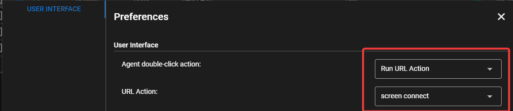

# URL Actions

URL Actions will run against an agent and open a configured URL in a new browser tab or window. This allows for integrations with various remote viewing softwares.

## Adding URL Actions

In the dashboard, browse to **Settings > Global Settings > URL Actions**. The available options are:

- **Name** - This identifies the URL Action in other parts of the dashboard
- **Description** - Optional description for the URL Action
- **Pattern** - This is the actual URL pattern that will open in the new browser tab/window. This field supports variables from the [Global Keystore](keystore.md) and [Script Variables](../script_variables.md).

### URL Pattern Example

!!!info 
    Variable names are *case sensitive*!

```
https://remote.example.com/connect?API_KEY={{global.API_KEY}}&agent_id={{agent.Remote ID}}
```

The above example uses a value defined in the **global keystore** named *API_KEY* and an **Agent custom field** called *remote id*. The URLs are properly encoded to work with any special characters or spaces returned in the values.

## Running URL Actions

In the agent table, right-click on the Agent and select **Run URL Action** and select the action to run.

You can also create a shortcut for this by setting the default double-click action to open a URL action:

Click on your username in the top right of the web UI > **Preferences**, then select **Run URL Action** and then select the URL action:



The URL action will now run when you double click on a row in the Agent table in the dashboard.