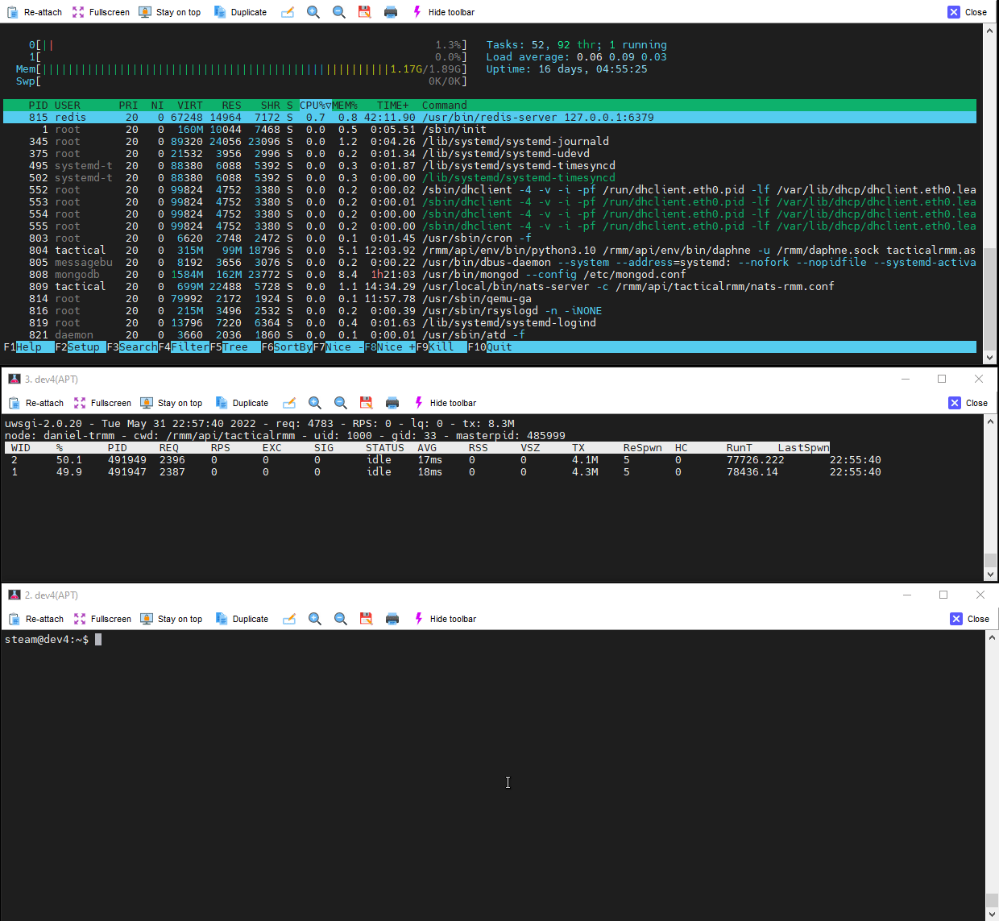

# Install Considerations

There's pluses and minuses to each install type (Standard vs Docker *which is currently unsupported*). Be aware that:

- There is no migration script. Once you've installed with one type there is no "conversion". You'll be installing a new server and migrating agents manually if you decide to go another way.

!!!warning
    Tactical RMM does not support changing DNS names, so choose your names wisely. If you need to change your DNS name later you will be uninstalling all old agents, and installing a new server and re-deploying agents.

## Debian vs Ubuntu

| Base RAM Usage | OS |
| --- | --- |
| 80MB | Clean install of Debian |
| 300MB | Clean install of Ubuntu |

Because of RAM usage alone, we recommend Debian 11.

## Traditional Install - **Officially supported**

- It's a VM/machine. One storage device to backup if you want to do VM based backups.
- You have a [backup](backup.md) and [restore](restore.md) script.
- Much easier to troubleshoot when things go wrong.
- Faster performance / easier to fine tune and customize to your needs.

## Docker Install
- Docker is more complicated in concept: has volumes and images.
- Backup/restore is via Docker methods only.
- Docker has container replication/mirroring options for redundancy/multiple servers.
- **NOT** officially supported and **NOT** recommended for production use at the moment unless you are very comfortable managing/troubleshooting docker.

## Azure VMs

Azure ranks their VM's in Series <https://azure.microsoft.com/en-us/pricing/details/virtual-machines/series/>.

Tactical RMM will run poorly in CPU limited VMs. So **DO NOT** use Series A or Series B VMs. You will need at least a Series F or better. Also, make sure there is no IO throttling / IOPS limits for the VM.

The same applies for other big cloud providers that throttle low end VMs.

## Larger Installs

If you're having more than 200 agents, that's a larger install. You're probably also a business and making (and saving?) money with Tactical RMM, you're [supporting](code_signing.md) the project right?

You should be aware of server defaults like `Default script run time: 120 seconds`

Imagine you have 10 check, on 500 computers, running every 120 seconds. 

For checks alone, that's 5000 writes every 120 seconds, or 3.6 million database entries created every 24hrs. Default retention on check history is 30 days, so your check history database is probably averaging 108,000,000 records before regular data purges. That's a lot of write-wear on your SSD-based storage layer. 

Do you really need your Disk Space check running more than 1-2 times a day? Probably not. 

Also consider staggering the times of all your checks, so that each check is naturally spreading the load on your server at more random intervals instead of focusing all checks at exactly the same time. 

So in Summary:

- Please support the project, we do need it!
- Adjust script default run intervals
- Don't have checks (and tasks) all run at the same time

## Load Testing TRMM

TRMM's uWSGI config is located at `/rmm/api/tacticalrmm/app.ini`. Full list of options [here](https://uwsgi-docs.readthedocs.io/en/latest/Options.html)

Use your HTTP load testing tool of choice to hit the TRMM API.<br/>
We will be using [vegeta](https://github.com/tsenart/vegeta) for the following example.

We'll also be using [uwsgitop](https://github.com/xrmx/uwsgitop) to monitor uwsgi in real time.<br/>
Please read [this SO post](https://stackoverflow.com/questions/17163091/how-to-read-uwsgi-stats-output) to understand how to read uwsgitop's output.

## Example load test

Our test server is a Hetzner CPX11 (2 x AMD EPYC @ 2.4Ghz, 2gb ram, 40GB ssd)

On your **trmm server**, do the following:

Edit `/rmm/api/tacticalrmm/app.ini` and add the following line to the bottom of the file:
```
stats = /tmp/stats.socket
```

File should look something like this:

```
tactical@trmm:/rmm/api/tacticalrmm$ cat app.ini
[uwsgi]
chdir = /rmm/api/tacticalrmm
module = tacticalrmm.wsgi
home = /rmm/api/env
master = true
processes = 2
threads = 2
enable-threads = true
socket = /rmm/api/tacticalrmm/tacticalrmm.sock
harakiri = 300
chmod-socket = 660
buffer-size = 65535
vacuum = true
die-on-term = true
max-requests = 500
disable-logging = true
stats = /tmp/stats.socket
```

Install uwsgitop

```
cd /rmm/api/tacticalrmm
source ../env/bin/activate
pip install --upgrade uwsgitop
```

Restart the uwsgi service

```
sudo systemctl restart rmm
```

Run it

```
uwsgitop /tmp/stats.socket
```

Now open another terminal and ssh into a separate linux server that is **NOT** the same server hosting your trmm instance.<br/>
We want to simulate agents connecting over LAN/WAN so while this step can be done from your trmm instance, it is not recommended as results will be skewed.

Download and install vegeta

```
wget https://github.com/tsenart/vegeta/releases/download/v12.8.4/vegeta_12.8.4_linux_amd64.tar.gz -O /tmp/vegeta.tar.gz \
    && tar -xvzf /tmp/vegeta.tar.gz -C /tmp \
    && sudo mv /tmp/vegeta /usr/local/bin/
```

Create a vegeta config file named `trmm.conf` with the following content.<br/>
Make sure to replace `api.example.com` with your subdomain and change the [API KEY](functions/api.md)

```
steam@dev4:~$ cat trmm.conf
GET https://api.example.com/core/version/
Content-Type: application/json
X-API-KEY: IHRQBT2XUBKNEJ42B1E0ZSHJXHMJY7CU
```

We will start with the `/core/version/` endpoint which will serve as our baseline since this is a very basic endpoint that just returns a string and does not hit the database or perform any calculations.

Now let's slam it as fast as we can (rate 0) with 100 workers for 5 seconds:

```
vegeta attack -targets trmm.conf -duration=5s -rate 0 -max-workers 100 | tee results.bin | vegeta report
```




We got 128 RPS (requests per second) with a 100% success rate.

Using `uwsgitop` running in a another terminal you should see an even distribution % between the processes with each worker sharing approx 50% of the total load, as shown in the gif above. If you have 4 processors then we should aim for around 25% per proc.

Now let's try a different TRMM server (BuyVM.net with 4 x Ryzen 9 3900X @3.8Ghz):

```
...
processes = 4
threads = 4
...
```

```
steam@dev4:~$ vegeta attack -targets trmm.conf -duration=5s -rate 0 -max-workers 100 | tee results.bin | vegeta report
Requests      [total, rate, throughput]         1277, 255.31, 239.61
Duration      [total, attack, wait]             5.33s, 5.002s, 327.651ms
Latencies     [min, mean, 50, 90, 95, 99, max]  229.061ms, 404.386ms, 330.467ms, 413.458ms, 1.182s, 1.346s, 1.456s
Bytes In      [total, mean]                     11493, 9.00
Bytes Out     [total, mean]                     0, 0.00
Success       [ratio]                           100.00%
Status Codes  [code:count]                      200:1277
Error Set:
```

Up to 255 RPS due to faster CPU model and more cores.

Feel free to increase the number of vegeta max-workers to stress it even further and other settings listed [here](https://github.com/tsenart/vegeta#usage-manual)

You should also load test endpoints that hit the database like `/agents/` or `clients/` to see how well your DB performs under load and try to get the most RPS.
