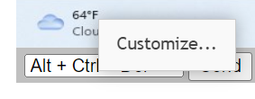
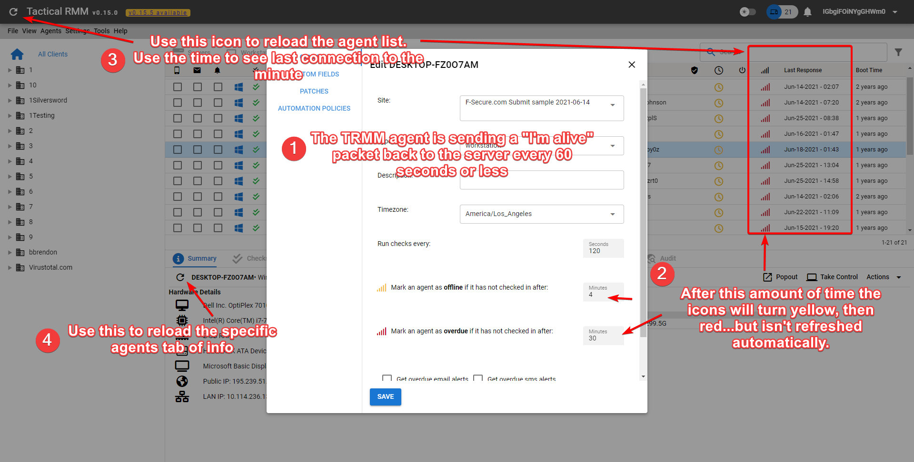

# Tips and Tricks

## Monitor your TRMM Instance via the Built-in Monitoring Endpoint.

!!!info
    Please refer to the [migration](#monitoring-endpoint-v2-migration-guide) guide below for TRMM Release v1.0.0

The health check endpoint provides key metrics and statuses about your RMM instance. It is designed for integration with monitoring tools like Uptime Kuma or other similar solutions.

Generate a random string to be used as a token and append it to the bottom of `/rmm/api/tacticalrmm/tacticalrmm/local_settings.py` like this:

  ```python
  MON_TOKEN = "SuperSekretToken123456"
  ```

Then restart Django to activate the endpoint with `sudo systemctl restart rmm.service`

Send a GET request to `https://api.yourdomain.com/core/v2/status/` with the `X-Mon-Token` header.

**Example using curl**:
  ```
  curl -H "X-Mon-Token: SuperSekretToken123456" https://api.yourdomain.com/core/v2/status/
  ```

The endpoint returns a JSON object with the following structure:

  **Response Fields**

  | **Field**                 | **Type**          | **Description**                                                                                     | **Example**       |
  |---------------------------|-------------------|-----------------------------------------------------------------------------------------------------|-------------------|
  | `version`                | `str`            | The current version of the RMM software.                                                           | `"1.0.0"`        |
  | `latest_agent_version`   | `str`            | The latest available version of the agent.                                                         | `"2.9.0"`         |
  | `agent_count`            | `int`            | The total number of agents connected to the RMM instance.                                          | `345`               |
  | `client_count`           | `int`            | The total number of clients registered in the RMM.                                                 | `14`               |
  | `site_count`             | `int`            | The total number of sites registered in the RMM.                                                   | `34`               |
  | `disk_usage_percent`     | `int`            | The percentage of disk space used by the RMM instance.                                             | `43`              |
  | `mem_usage_percent`      | `int`            | The percentage of memory usage by the RMM instance.                                                | `54`              |
  | `days_until_cert_expires`| `int`            | The number of days until the SSL certificate expires.                                              | `43`              |
  | `cert_expired`           | `bool`           | Indicates if the SSL certificate has already expired.                                              | `false`           |
  | `redis_ping`             | `bool`           | Indicates if the Redis service is responding.                                                      | `true`            |
  | `celery_queue_len`       | `int`            | The current number of tasks in the Celery queue.<br>**Note**: a high number here (> 100) usually means your queue is stuck.<br> See [here](./troubleshooting.md#celery-queue-stuck) for how to resolve.                                                  | `0`            |
  | `celery_queue_health`    | `str`            | The health status of the Celery queue. Possible values are `"healthy"` or `"unhealthy"`.           | `"healthy"`       |
  | `nats_std_ping`          | `bool`           | Indicates if the NATS standard service is responding.                                              | `true`            |
  | `nats_ws_ping`           | `bool`           | Indicates if the NATS WebSocket service is responding.                                             | `true`            |
  | `mesh_ping`              | `bool`           | Indicates if the MeshCentral service is responding.                                                | `true`            |
  | `services_running`       | `dict[str, bool]`| A dictionary of service names with their respective running statuses.                              | See Below        |


**Example Response**

  ```json
  {
      "version": "1.0.0",
      "latest_agent_version": "2.8.0",
      "agent_count": 345,
      "client_count": 14,
      "site_count":34,
      "disk_usage_percent": 43,
      "mem_usage_percent": 54,
      "days_until_cert_expires": 43,
      "cert_expired": false,
      "redis_ping": true,
      "celery_queue_len": 0,
      "celery_queue_health": "healthy",
      "nats_std_ping": true,
      "nats_ws_ping": true,
      "mesh_ping": true,
      "services_running": {
          "mesh": true,
          "daphne": true,
          "celery": true,
          "celerybeat": true,
          "redis": true,
          "nats": true,
          "nats-api": true
      }
  }
  ```

### Monitoring Endpoint v2 Migration Guide

Starting with Tactical RMM release v1.0.0, the monitoring endpoint has been upgraded from `/core/status/` to `/core/v2/status/` (v2) with improved response structure and authentication method. The changes include:

- New Endpoint: The URL has changed from `/core/status/` to `/core/v2/status/`.
- Authentication Method: Instead of sending the token in the request body, it must now be included in the `X-Mon-Token` request header.
- HTTP Method Change: The request type has changed from `POST` to `GET`.
- Enhanced Response Data: The new response includes additional fields such as `celery_queue_len`, `celery_queue_health`, `nats_std_ping`, `nats_ws_ping`, and `mesh_ping`.
- Removed fields: The `services_running` response no longer includes `django`, `nginx`, and `postgres` because if any of these services were not running, the monitoring endpoint itself would be inaccessible, making their inclusion redundant. The `mongo` service has also been removed as you should already be using posgresql now.

## Server Monitoring

Monitor Network usage: <https://humdi.net/vnstat/>

Realtime Everything Usage: (_only run when needed because it uses a lot of resources_): <https://learn.netdata.cloud/docs/agent/packaging/installer/methods/kickstart>

## Customize User Interface

At the top right of your web administration interface, click your **Username > preferences**. Set default tab: Servers | Workstations | Mixed


*****

## Use the Filters in the Agent List


*****
## MeshCentral

Tactical RMM is actually 2 products: An RMM service with agent, and a secondary [MeshCentral](https://github.com/Ylianst/MeshCentral) install that handles the `Take Control` and `Remote Background` stuff.

Want to download multiple files?

> ZIP zip's the currently selected file(s) and saves it in the current directory. Then you can download the ZIP. It doesn't download and ZIP on the fly.

If you want to enable automatic clipboard transfers just click the option under [Settings button](https://ylianst.github.io/MeshCentral/meshcentral/devicetabs/#during-a-desktop-session)

### Adjust Settings

Right-click the connect button in **Remote Background > Terminal** for shell options.


Right-click the connect button in **Take Control** for connection options.


### Enable Remote Control Options

!!!note
    These settings are independent of Tactical RMM. Enable features (like auto remove inactive devices) with caution.

If you need to comply with GDPR regulations and ensure employee rights legislation is complied with, you can make sure that users receive a popup to inform them so they are aware when your techs log in and connect to their machine. You can enable a banner that shows when a remote connection is established.

1. Login to meshcentral as the [mesh superuser](./mesh_integration.md#get-a-url-to-login-to-mesh-as-the-mesh-superuser).
2. Click on My Account
3. Click on the device group you want to enable notifications or accept connection etc on (probably TacticalRMM).
4. Next to User Consent click edit (the wee pencil)<br>

5. You can also change features by ticking whatever boxes you want in there (Features: Sync server device name to hostname, Automatically remove inactive devices, Notify/Prompt for Consent/Connection Toolbar settings).<br>

6. Ok your way out

### Agent Online / Offline logs

In mesh from the agent | General Tab


### Sending Custom Keystrokes to Agent

Some of the native hotkeys will not send thru the MeshCentral remote control window (like ++alt+tab++). You can right-click the special key list in the bottom left of the Remote Control window.



and add new ones like

* ++alt+shift+tab++: Task switching between windows
* ++win+tab++: Bring up thumbnail based running program switcher

### Syncing PC name to MeshCentral

If you install TRMM agent, it will add the PC to meshcentral with the current computer name. If you later rename the computer, MeshCentral will not update that PC name by default unless you enable the sync name option in MeshCentral


## Scripts

### When Running Scripts

When [running scripts](functions/scripting.md#script-arguments) use the (i) at the end of the script name to:

- Hover: see script parameter syntax help
- Left Click: Opens the script source in Github


## 3rd Party Software Patching

Chocolatey is the default 3rd party software library that is used to populate the software tab. You can install anything that is available at chocolatey.org

It is installed by default during the TRMM agent installation into the default choco install folder (`C:\ProgramData\chocolatey`). If there is an existing choco install or other problem you can delete that folder and fully reinstall by it running the standard choco install script which can be found here: <https://chocolatey.org/install.ps1>

If you're interested in converting your software to Chocolatey managed you will need to look at customizing this script <https://github.com/amidaware/community-scripts/blob/main/scripts_wip/Win_Choco_ConvertToChocoManaged.ps1>. If you have improvements please [contribute](https://docs.tacticalrmm.com/contributing_community_scripts/).

Once you've made your script, that will take existing software and convert it to Chocolatey managed (see what Chocolatey manages on an agent with).

```batch
choco list
```

Next, you're going to schedule your updates.

Because of [community repo limits](https://docs.chocolatey.org/en-us/community-repository/community-packNeages-disclaimer#rate-limiting), you can [purchase chocolatey](https://chocolatey.org/pricing), [host your own chocolatey server](https://docs.chocolatey.org/en-us/features/host-packages), or use this script sparingly <https://github.com/amidaware/community-scripts/blob/main/scripts/Win_Chocolatey_Manage_Apps_Bulk.ps1> using `-Mode upgrade -Hosts x` where x is the max number of machines on an internet connection.


## Run Intervals for Checks

You can modify at several locations / levels:

* **Settings Menu > Automation Manager > Checks tab >** Edit check
* Agent Level: **Edit Agent > Run checks every**
* Edit Check under agent > Run this check every (seconds)

!!!note
    The interval under check will override agent check if set.

## Understanding refreshing TRMM data

How to get updated data and see agents last communication time.



## Why are usernames in italics?

It's the last logged in user, when italicized it means nobody is currently logged in.

## Getting false SMS and Email alerts from scripts?

If you're getting `Error 98` from script timeouts between the time the server asked the agent to run it, and the timeout value of the script the server never received a response. You can minimize the false alerts but adding the script timeouts to informational instead of warnings. 

You can also increase the consecutive failures to 2+


