# Unsupported Proxies

!!!note
    Using Proxies/reverse proxies with Tactical RMM is not a supported configuration, the information below is provided here for your reference.

    Although these aren't officially supported configurations, we generally will help point you in the right direction. Please use the Discord [#unsupported channel](https://discord.com/channels/736478043522072608/888474319750066177) to discuss issues related to these complex installations.


## General Notes on Proxies and Tactical RMM

### Port 443

Make sure websockets option is enabled.

All 3 URL's will need to be configured: `rmm`, `api`, `mesh`

For `mesh` review [TLS Offloading](https://ylianst.github.io/MeshCentral/meshcentral/#tls-offloading).

## Cloudflare Proxy and Cloudflare Tunnel

[Youtube Video Showing How](https://www.youtube.com/watch?v=70ME_EaoTxs)

!!!note
    Between August 2023 and March 2024, MeshCentral would not work properly through CloudFlare proxy/tunnels. Symptoms were Clicking on the "Connect" button under "Desktop" or "Terminal" results in "Disconnected" approximately 9/10 times.<br>Something changed on CloudFlare's end. You can still track the GitHub issue about it [here](https://github.com/Ylianst/MeshCentral/issues/5302).<br>As of 23/03/2024 CloudFlare made some kind of change that fixed it without any acknowledgement. While it has started working again, there are no guarantees that this will continue to work. Use at your own risk.

First, just complete a TRMM install like normal- you don't need to put the API, RMM, or Mesh domains into Cloudflare however.
You must still follow the TXT record to prove that it's your domain.

Once your TRMM install is completed, navigate to CloudFlare Tunnels and create a new Tunnel.
Give it any name, Personally, I chose the name TRMM. Now, follow the instructions to install the connector on your distro of choice.

### Adding the Entries to Cloudflare

Now, we need to begin adding the domains.
For API, for the subdomain enter the subdomain you chose earlier. In my case api.mydomain
Leave "Path" empty.
For Service, choose HTTPS then in the URL put your server's LOCAL ip and then port 443.

Scroll down and extend Additional Application Settings. From here, extend TLS and set Origin Server Name to the subdomain + domain that you're using.

Repeat this step for RMM.

Mesh is slightly different.
For the subdomain, enter the subdomain you chose earlier. In my case mesh.mydomain, still being sure to leave Path empty.
For service, pick Type HTTP, and for URL put your server's LOCAL ip then:4430.

Extend Additional Application Settings and then HTTP settings and set the HTTP Host Header to the subdomain + domain that you're using.

```
api.{domain}
https | TRMM server IP | 443
Advanced: Origin Server Name | api.{domain}

mesh.{domain}
http | TRMM server IP | 4430
Advanced: HTTP Host Header | mesh.{domain}

rmm.{domain}
https | TRMM server IP | 443
Advanced: Origin Server Name | rmm.{domain}

```

Now, Mesh will check the external cert when it boots up in order to verify the domain. This will fail as TRMM on setup adds a 127.0.1.1 entry to the /etc/hosts file.

To fix this, SSH into your TRMM server and run the following command:

```bash
nano /etc/hosts
```

On the second line of your hosts file, you should see all the entries listed.
```bash
127.0.1.1   trmm.yourdomain trmm api.yourdomain rmm.yourdomain mesh.yourdomain
```

You need to <ins>**remove**</ins> the mesh.yourdomain entry at the end.
Once you've done this, you're ready to go. All sites should be accessible and you should be able to add agents and connect/work with them.

## Caddy 2

This section will cover using Caddy as a reverse proxy in front of TacticalRMM.  The below example uses AWS Route53, ports 4443/8080, and assumes you are using Docker.

In your Caddyfile, create a wild card route with 3 handlers as shown below.  

```bash
# Caddyfile

{
    email fake@amidaware.com

    acme_dns route53

} # Global options

*.amidaware.com {
        tls {
           dns route53 {
             max_retries 10
             access_key_id "AKIAxxxxxxx"
             secret_access_key "4CXXXXXXXXXXXXXXXXX"
             region "us-east-1"
           }
        } # tls

        @rmm host rmm.amidaware.com
        handle @rmm {
                reverse_proxy rmm.amidaware.com:4443 {
                        transport http {
                                tls_insecure_skip_verify
                        }
                }

        } # rmm

        @api host api.amidaware.com
        handle @api {
                reverse_proxy api.amidaware.com:4443 {
                        transport http {
                                tls_insecure_skip_verify
                        }
                }

        } # api

        @mesh host mesh.amidaware.com
        handle @mesh {
                reverse_proxy https://mesh.amidaware.com:4443 {
                     transport http {
                        tls_insecure_skip_verify
                     }
                }
        } # mesh

} # *.amidaware.com
``` 

In your TacticalRMM .env file, change **TRMM_HTTP_PORT** and **TRMM_HTTPS_PORT** so that it matches the port you selected in your Caddyfile.  In this example it's 4443 and 8080.  Also change the **MESH_PERSISTENT_CONFIG** to 1 so t>

```bash
TRMM_HTTP_PORT=8080
TRMM_HTTPS_PORT=4443
```

Update your mesh config **certUrl** option with your domain Url as shown below.

```

  "domains": {
    "": {
      ....
      "certUrl": "https://rmm.amidaware.com",
      "agentConfig": [ "webSocketMaskOverride=0" ]
    }
  },

```

Restart your Caddy containers

```
docker compose restart
```

Locate and make a note of your Caddy certificate files.  In this example it was created in:

```
/mydockercontainers/caddy_data/caddy/certificates/acme-v02.api.letsencrypt.org-directory/wildcard_.amidaware.com
```

We need to update TacticalRMM's .env file with the Caddy certificates.  Create a script named renew-cert.sh and change **CERT_CRT** and **CERT_KEY** to match the location in the previous step.

```bash
# renew-cert.sh

#!/bin/bash

CERT_CRT=/mydockercontainers/caddy/caddy_data/caddy/certificates/acme-v02.api.letsencrypt.org-directory/wildcard_.amidaware.com/wildcard_.amidaware.com.crt
CERT_KEY=/mydockercontainers/caddy/caddy_data/caddy/certificates/acme-v02.api.letsencrypt.org-directory/wildcard_.amidaware.com/wildcard_.amidaware.com.key

echo "CERT_PUB_KEY=$(sudo base64 -w 0 ${CERT_CRT})" >> .env
echo "CERT_PRIV_KEY=$(sudo base64 -w 0 ${CERT_KEY})" >> .env

echo "Restarting TacticalRMM containers please wait ..."

docker compose down
docker compose up -d --remove-orphans

echo "Make sure to remove the old cert lines in .env file."

```

Run the script manually when needed or add to cron.  

```
chmod +x renew-cert.sh
./renew-cert.sh
```

That's all folks.  Caddy should be reverse proxying all traffic to TacticalRMM correctly.

## Caddy Std Install

This is for putting Caddy as a reverse proxy in front of a standard installation of Tactical RMM. It will leave the nginx reverse proxy in place and have double proxies as a result.

Caddy Config

```
{
  auto_https off
  http_port 80
  https_port 443
}

#snips
(cert) {
   tls /path/to/your/fullchain.cer /path/to/your/domain.key
}
#rmm
rmm.example.com {
import cert
  encode gzip
  reverse_proxy YOUR_RMM_IP:443 {
     transport http {
        tls_insecure_skip_verify  
      }
   }
}

#api
api.example.com {
import cert
  encode gzip
  reverse_proxy YOUR_RMM_IP:443 {
     transport http {
        tls_insecure_skip_verify  
      }
   }
}

#mesh
mesh.example.com {
import cert
  encode gzip
  reverse_proxy https://mesh.example.com:443 {
     transport http {
        tls_insecure_skip_verify  
      }
   }
}
```

For the meshcentral config:

```
{
  "settings": {
    ....
    "tlsOffload": "YOUR_CADDY_IP",
    ....
  },
  "domains": {
    "": {
      ....
      "certUrl": "https://YOUR_CADDY_IP:443",
      "agentConfig": [ "webSocketMaskOverride=0" ],
      ....
    }
  }
}
```

## Traefikv2

Offsite Resource: <https://gitlab.com/NiceGuyIT/tactical-goodies/-/tree/main/traefik>

This section will assume that by default Traefik will reverse proxy everything on port 443.

Here is a basic Traefik config with docker-compose. Note, the file.directory and file.watch are important:

```bash
version: "3.7"
services:
  traefik:
    container_name: traefik24
    image: traefik:v2.4
    restart: unless-stopped
    command:
      - --entryPoints.http.address=:80
      - --entryPoints.https.address=:443
      - --providers.docker=true
      - --providers.docker.endpoint=unix:///var/run/docker.sock
      - --providers.docker.defaultrule=HostHeader(`{{ index .Labels "com.docker.compose.service" }}.$DOMAINNAME`)
      ## This is important, to load the config for RMM and Mesh
      - --providers.file.directory=rules # Load dynamic configuration from one or more .toml or .yml files in a directory.
      - --providers.file.watch=true # Only works on top level files in the rules folder
      ####
      - --certificatesresolvers.dns-cloudflare.acme.dnschallenge=true
      - --certificatesResolvers.dns-cloudflare.acme.email=$CLOUDFLARE_EMAIL
      - --certificatesResolvers.dns-cloudflare.acme.storage=/acme.json
      - --certificatesResolvers.dns-cloudflare.acme.dnsChallenge.provider=cloudflare
      - --certificatesResolvers.dns-cloudflare.acme.dnsChallenge.resolvers=1.1.1.1:53,1.0.0.1:53
    ports:
      - target: 80
        published: 80
        protocol: tcp
        mode: host
      - target: 443
        published: 443
        protocol: tcp
        mode: host
    volumes:
        ##The rules that we will load##
      - $USERDIR/docker/traefik2/rules:/rules
        ##
      - /var/run/docker.sock:/var/run/docker.sock:ro
      - $USERDIR/docker/traefik2/acme/acme.json:/acme.json
      - $USERDIR/docker/traefik2/traefik.log:/traefik.log
    environment:
      - CF_API_EMAIL=$CLOUDFLARE_EMAIL
      - CF_API_KEY=$CLOUDFLARE_API_KEY
    labels:
      - "traefik.enable=true"
      # HTTP-to-HTTPS Redirect
      - "traefik.http.routers.http-catchall.entrypoints=http"
      - "traefik.http.routers.http-catchall.rule=HostRegexp(`{host:.+}`)"
      - "traefik.http.routers.http-catchall.middlewares=redirect-to-https"
      - "traefik.http.middlewares.redirect-to-https.redirectscheme.scheme=https"
      # HTTP Routers
      - "traefik.http.routers.traefik-rtr.entrypoints=https"
      - "traefik.http.routers.traefik-rtr.rule=HostHeader(`traefik.$DOMAINNAME`)"
      - "traefik.http.routers.traefik-rtr.tls=true"
      - "traefik.http.routers.traefik-rtr.tls.domains[0].main=$DOMAINNAME"
      - "traefik.http.routers.traefik-rtr.tls.domains[0].sans=*.$DOMAINNAME"
```

Before proceeding, we need to change the port 443 to 4443 and 80 to 8080 because the port 443 and 80 are already used by Traefik.

Here is a snippet of the only thing you should modify into docker-compose file of the installation:

```bash
  # container for tactical reverse proxy
  tactical-nginx:
    container_name: trmm-nginx
    image: ${IMAGE_REPO}tactical-nginx:${VERSION}
    restart: always
    environment:
      APP_HOST: ${APP_HOST}
      API_HOST: ${API_HOST}
      MESH_HOST: ${MESH_HOST}
      CERT_PUB_KEY: ${CERT_PUB_KEY}
      CERT_PRIV_KEY: ${CERT_PRIV_KEY}
    networks:
      proxy:
        ipv4_address: 172.20.0.20
    ports:
      - "8080:8080" ## port 8080 instead of 80
      - "4443:4443" ## port 4443 instead of 443
```

Once saved, make sure you run the docker-compose or installation script at least once, so all the directory structures are created.
Once you have your certificate (acme.json) generated by traefikv2 we will be able to extract it for rmm.

Copy the acme.json create by traefik into the root of your rmm directory (In my case it's $USERDIR/docker/rmm) which you should have already defined.
After that we can run this docker to extract the certificates for us:

```bash
version: "3.7"
services:
##Copy the acme.json of Traefik2 at volumes: (userdir/docker/rmm in this case)
  traefik-certs-dumper:
    image: ldez/traefik-certs-dumper:v2.7.4
    entrypoint: sh -c '
      apk add jq
      ; while ! [ -e /data/acme.json ]
      || ! [ `jq ".[] | .Certificates | length" /data/acme.json` != 0 ]; do
      sleep 1
      ; done
      && traefik-certs-dumper file --version v2 --watch
      --source /data/acme.json --dest data/certs'
    volumes:
      - $USERDIR/docker/rmm:/data
```

Once completed, you should have 1 new folder in your rmm directory $USERDIR/docker/rmm/**certs** in this example.
As the installation instruction, we will pass those to the .env:

```bash
echo "CERT_PUB_KEY=$(sudo base64 -w 0 $USERDIR/docker/rmm/certs/certs/**yourdomain.com.crt**)" >> .env
echo "CERT_PRIV_KEY=$(sudo base64 -w 0 $USERDIR/docker/rmm/certs/private/**yourdomain.com.key**)" >> .env
```

Next we can create 3 rules to tell Traefik to correctly route the https and agent.
For that we will create 2 rules into Traefik directory as per it's configuration. folder/traefik/rules

create:

```bash
nano app-mesh.toml
```

and inside it we add:

```bash
[http.routers]
  [http.routers.mesh-rtr]
      entryPoints = ["https"]
      rule = "Host(`mesh.**yourdomain.com**`)"
      service = "mesh-svc"
##middleware with 2FA
[http.services]
  [http.services.mesh-svc]
    [http.services.mesh-svc.loadBalancer]
      passHostHeader = true
      [[http.services.mesh-svc.loadBalancer.servers]]
        url = "https://**xxx.xxx.xxx.xxx**:4443" # or whatever your external host's IP is
```

create:

```bash
nano app-meshagent.toml
```
and inside it we add:

```bash
[http.routers]
  [http.routers.mesh-rtr1]
      entryPoints = ["https"]
      rule = """Host(`mesh.**yourdomain.com**`) &&
        PathPrefix( `/agent.ashx`, `/meshrelay.ashx`, ) &&
        Headers(`X-Forwarded-Proto`, `wss`) """
    ##Don't add middle where, the agent wont work.
[http.services]
  [http.services.mesh-svc1]
    [http.services.mesh-svc.loadBalancer]
      passHostHeader = true
      [[http.services.mesh-svc1.loadBalancer.servers]]
        url = "https://**xxx.xxx.xxx.xxx**:4443" # or whatever your external host's IP is
```

create:

```bash
nano app-rmm.toml
```

and inside it we add:

```bash
[http.routers]
  [http.routers.rmm-rtr]
      entryPoints = ["https"]
      rule = "Host(`rmm.**yourdomain.com**`)"
      service = "rmm-svc"

      ##middleware with 2FA

[http.services]
  [http.services.rmm-svc]
    [http.services.rmm-svc.loadBalancer]
      passHostHeader = true
      [[http.services.rmm-svc.loadBalancer.servers]]
        url = "https://xxx.xxx.xxx.xxx:4443" # or whatever your external host's IP:port is
```

That's it, you can now restart Tactical. rmm and mesh.yourdomain.com should work, same for the agent.
Please note that if you have a middleware with 2FA you can still use it with the inside mesh.toml, but do not add it with the agent.

## HAProxy

Check / change the MeshCentral config.json, some of the values may be set already. CertUrl must be changed to point to the HAProxy server if not using the same certs for both HAProxy and TRMM.

### MeshCentral Adjustment

Credit to [@bradhawkins](https://github.com/bradhawkins85)

Edit MeshCentral config:

```bash
nano /meshcentral/meshcentral-data/config.json
```

Insert this (modify `HAProxyIP` to your network):

```conf
{
  "settings": {
    "Port": 4443,
    "AliasPort": 443,
    "RedirPort": 8080,
    "TlsOffload": "127.0.0.1",
  },
  "domains": {
    "": {
      "CertUrl": "https://HAProxyIP:443/",
    }
  }
}
```

Restart MeshCentral:

```bash
systemctl meshcentral restart
```

### NGINX ADJUSTMENTS

You will need to edit the nginx.conf file in the http section on the trmm server to recognize the X-Forwarded-For Header that will be sent from haproxy.

Edit file /etc/nginx/nginx.conf
Add the lines from 'real_ip' module inside http tag:

```conf
set_real_ip_from    192.168.0.200; #IP Address of your haproxy server
real_ip_header      X-Forwarded-For;
```

Restart nginx:

```bash
systemctl restart nginx.service
```


### HAProxy Config

The order of use_backend is important, and `Tactical-Mesh-WebSocket_ipvANY` must be before `Tactical-Mesh_ipvANY`.
This assumes a standard VM install or Docker instance, **unaltered**.
If you've altered exposed ports on your VM or Docker instance, those will need to be adjusted in the configuration.
The values of `timeout connect`, `timeout server`, and `timeout tunnel` have been configured to maintain a stable agent connection, however you may need to adjust these values to suit your environment:

```conf
frontend http-to-https-shared
	  bind			        0.0.0.0:80
	  mode			        http
	  log			          global
    option			      socket-stats
	  option			      http-server-close
    option			      dontlognull
    option            forwardfor
    acl https ssl_fc
    http-request set-header         X-Forwarded-Proto http if !https
    http-request set-header         X-Forwarded-Proto https if https
    http-request add-header         X-Real-IP %[src]
	  timeout client		30000
    acl			          rmm	    var(txn.txnhost) -m str -i rmm.example.com
	  acl			          api	    var(txn.txnhost) -m str -i api.example.com
	  acl			          mesh    var(txn.txnhost) -m str -i mesh.example.com
    http-request set-var(txn.txnhost) hdr(host)
    http-request redirect scheme https  if  rmm
	  http-request redirect scheme https  if  api
	  http-request redirect scheme https  if  mesh


frontend https-shared
	  bind			        0.0.0.0:443   ssl crt-list /var/etc/haproxy/HTTPS.crt_list  #ADJUST THIS TO YOUR OWN SSL CERTIFICATES
	  mode			        http
	  log			          global
	  option			      socket-stats
	  option			      dontlognull
	  option			      http-server-close
	  option			      forwardfor
	  acl https ssl_fc
	  http-request set-header		X-Forwarded-Proto http if !https
	  http-request set-header		X-Forwarded-Proto https if https
	  timeout client		30000
	  acl               aclcrt_https_shared     var(txn.txnhost) -m reg -i ^([^\.]*)\.example\.com(:([0-9]){1,5})?$
    acl			          rmm	    var(txn.txnhost) -m str -i rmm.example.com
	  acl			          nats-websocket	  var(txn.txnpath) -m sub -i /natsws
	  acl			          api	    var(txn.txnhost) -m str -i api.example.com
	  acl			          is_websocket	  hdr(Upgrade) -i WebSocket
	  acl			          mesh	  var(txn.txnhost) -m str -i mesh.example.com
	  acl			          api-ws	  var(txn.txnhost) -m sub -i api.example.com
    http-request set-var(txn.txnhost) hdr(host)
    http-request set-var(txn.txnpath) path
    use_backend rmm.example.com_ipvANY  if  rmm
  	use_backend rmm.example.com-websocket_ipvANY  if  nats-websocket api-ws
  	use_backend rmm.example.com_ipvANY  if  api
  	use_backend mesh.example.com-websocket_ipvANY  if  is_websocket mesh
  	use_backend mesh.example.com_ipvANY  if  mesh


backend rmm.example.com_ipvANY
	  mode			        http
	  log			          global
	  timeout connect		30000
	  timeout server		30000
	  retries			      3
	  http-request add-header X-Forwarded-Host %[req.hdr(Host)]
	  http-request add-header X-Forwarded-Proto https
	  server			      rmm x.x.x.x:443 ssl  verify none

backend rmm.example.com-websocket_ipvANY
	  mode			        http
	  log			          global
	  timeout connect		30000
	  timeout server		30000
	  retries			      3
	  timeout tunnel    3600000
	  http-request add-header X-Forwarded-Host %[req.hdr(Host)]
	  http-request add-header X-Forwarded-Proto https
	  server			      rmm-websocket x.x.x.x:443 ssl  verify none

backend mesh.example.com-websocket_ipvANY
	  mode			        http
	  log			          global
	  timeout connect		3000
	  timeout server		3000
	  retries			      3
	  timeout tunnel    3600000
	  http-request add-header X-Forwarded-Host %[req.hdr(Host)]
	  http-request add-header X-Forwarded-Proto https
	  server			      mesh-websocket x.x.x.x:443 ssl  verify none

backend mesh.example.com_ipvANY
	  mode			        http
	  log			          global
	  timeout connect		15000
	  timeout server		15000
	  retries			      3
	  timeout tunnel    15000
	  http-request add-header X-Forwarded-Host %[req.hdr(Host)]
	  http-request add-header X-Forwarded-Proto https
	  server			      mesh x.x.x.x:443 ssl  verify none
```

### HAProxy How-to for pfSense

<https://github.com/ninjamonkey198206/T-RMM-PFSense-HAProxy-config>

### HAProxy How-to for Baremetal

<https://github.com/ninjamonkey198206/T-RMM-Baremetal-HAProxy>

### HAProxy in TCP Mode, pfSense

In this scenario, you install TRMM as per documentation.
Meaning your certificates are generated and managed on your TRMM server, just use the `install.sh` and follow docs and on-screen instructions.

HAProxy here will just pass the traffic to the NGINX on TRMM server. No certificate management.
Only use this method if you have more than 1 server that need to use port 443 on the same public IP.

#### Assumptions

These are some assumptions made to make this guide, short, easy to follow and to the point.
Of course you can adapt it to your environment and/or current configuration.

- You have a pfSense firewall.
- You have HAProxy installed.
- You don't have any `http` frontends on your HAProxy.
- You have firewall rule to allow traffic from your WAN to HAProxy 443 port.
- You have set Max Connections on Settings to a value MORE than the agents you plan to connect.
- Your subdomains are: `api`, `mesh`, `rmm`
- You can resolve `(rmm|api|mesh).example.com` to your local TRMM server when in your local network.
- You can resolve `(rmm|api|mesh).example.com` to your public IP when you are outside of your local network.

#### Global Settings

Config file format, for reference:

```text
global
  maxconn     50000
  stats socket /tmp/haproxy.socket level admin  expose-fd listeners
  gid     80
  nbproc      1
  nbthread      1
  hard-stop-after   15m
  chroot        /tmp/haproxy_chroot
  daemon
  tune.ssl.default-dh-param 2048
  server-state-file /tmp/haproxy_server_state
```

#### Values you will have to replace with your own

- 10.10.10.100 - Change with your TRMM local IP.
- example.com - Change with your domain.

#### Backend

Navigate to `Services` -> `HAProxy` -> `Backend`

- Click ⤵️Add

##### Backend server pool

- Name: `trmm-backend`
- On Server list, Click ⤵️
- Name: `trmm-server`
- Forwardto: `Address+Port`
- Address: `10.10.10.100` (Reminder: change this)
- Port: `443`
- Max conn: `10000` (Or `0` for unlimited)

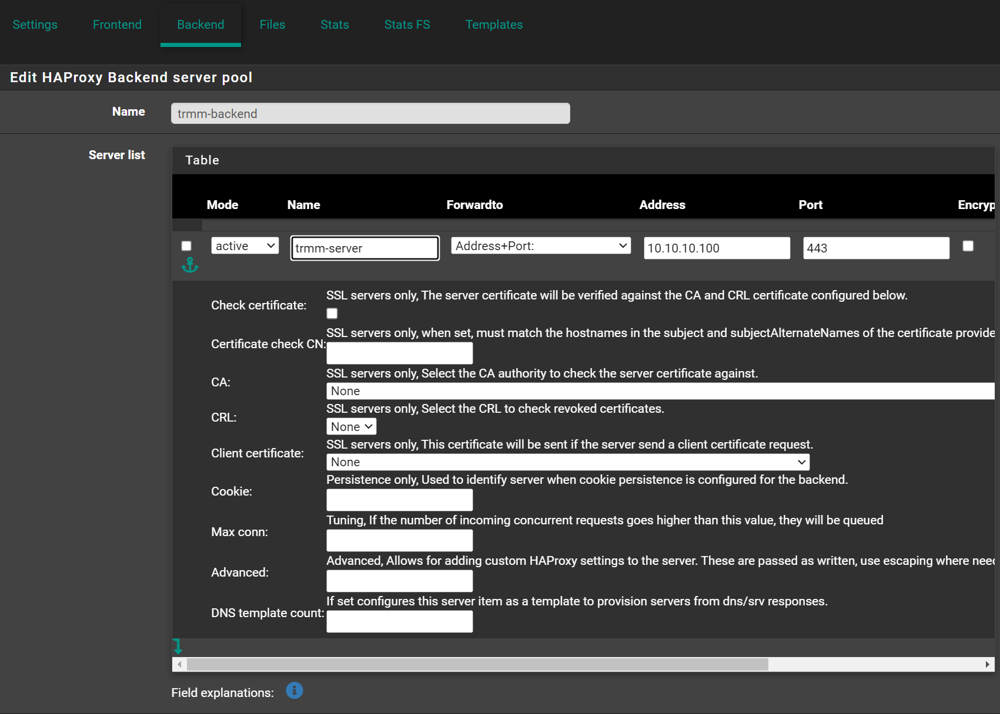

##### Timeout / retry settings

- Connection timeout: `300000` (Note: it has more 0s than the default)
- Server timeout: `300000` (Note: it has more 0s than the default)
- Retries: `3`


##### Health checking

- Health check method: `SSL`

> Keep this to `none` while installing or updating certificates.
> There might be problems if it's set to `SSL` or `basic` while doing so.


##### Advanced settings

Please read the warning there, and the note at the bottom.
This optional and it's use is to show the real public IP of the agent.

- Check `Use Client-IP to connect to backend servers.

> Some remote agents would not let me do RDP without this option.
> Play with it and see what works for you.

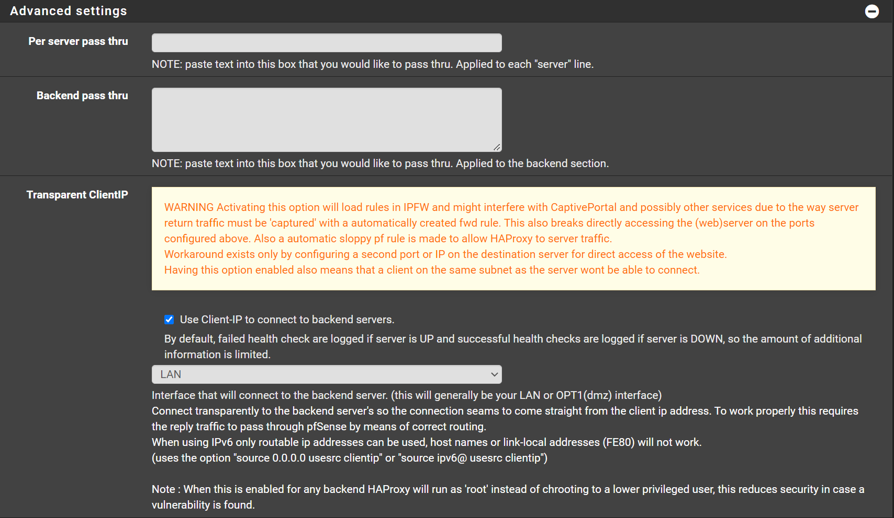

It works well for me, there are cases that it might not work on all environments.

##### For those who like the config files

```text
backend trmm-backend_ipv4
  mode    tcp
  log     global
  timeout connect   300000
  timeout server    300000
  retries     3
  source ipv4@ usesrc clientip
  option      ssl-hello-chk
  server      trmm-server 10.10.10.100:443 check inter 1000  maxconn 10000
```

#### Frontend

Navigate to `Services` -> `HAProxy` -> `Frontend`

- Click ⤵️Add

##### Edit HAProxy Frontend

- Name: `FrontendTCP`
- Status: `Active`
- On External address, click ⤵️
- Listen address: `WAN address (IPv4)`
- Port: `443`
- Max connections: `10000` (Or `0` or unlimited`)
- Type: `ssl/https (TCP mode)`

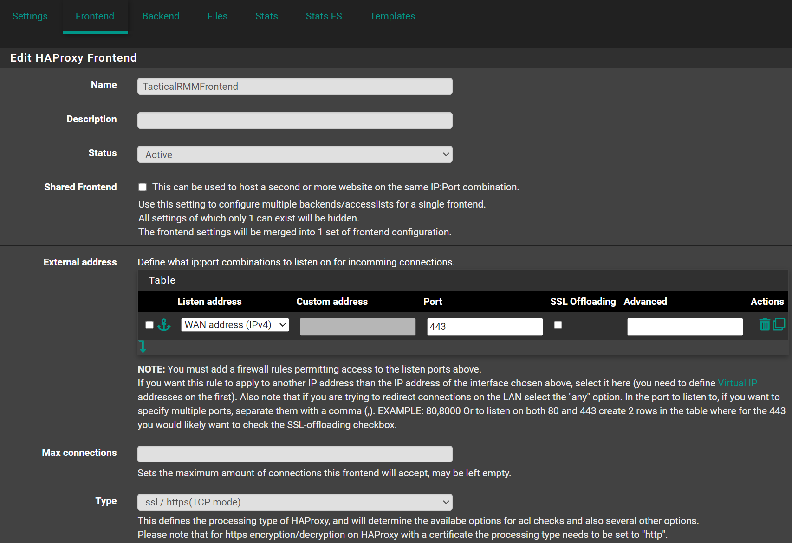

##### Default backend, access control lists and actions

- On Access Control lists, Click ⤵️
- Name: `tactical`
- Expression `Server Name Indication TLS extension regex:`
- value: `(rmm|api|mesh)\.example\.com`
- On Actions, Click ⤵️
- Action: `Use Backend`
- Condition acl names: `tactical`
- backend: `trmm-backend`

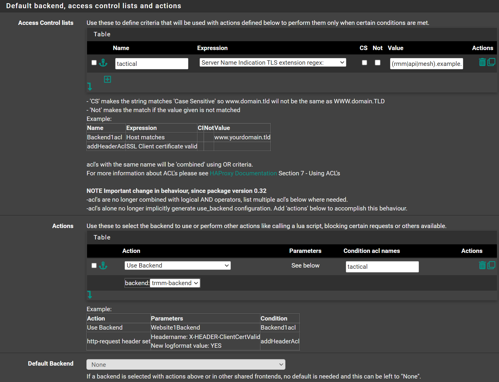

##### Advanced settings

- Client timeout: `300000` (Note: it has more 0s than the default)
- Use "httpclose" option: `http-server-close`


Click 💾Save
Click ✔️Apply Changes

##### For those who like the config files

```text
frontend Frontend-SNI
  bind      YOURWANIP:443 name YOURWANIP:443
  mode      tcp
  log     global
  maxconn     10000
  timeout client    300000
  tcp-request inspect-delay 5s
  acl     tactical  req.ssl_sni -m reg -i (rmm|mesh|api)\.yourdomain\.com
  tcp-request content accept if { req.ssl_hello_type 1 }
  use_backend tactical_ipv4  if  trmm-backend
```

### HAProxy in TCP Mode, OPNsense

In this scenario, you install TRMM as per documentation.
Meaning your certificates are generated and managed on your TRMM server, just use the `install.sh` and follow docs and on-screen instructions.

HAProxy here will just pass the traffic to the NGINX on TRMM server. No certificate management.
Only use this method if you have more than 1 server that need to use port 443 on the same public IP.

#### Assumptions

These are some assumptions made to make this guide, short, easy to follow and to the point.
Of course you can adapt it to your environment and/or current configuration.

- You have a OPNsense firewall.
- You have HAProxy installed.
- You don't have any `http` frontends on your HAProxy.
- You have port forward to forward traffic from your WAN 443 port to OPNsense 443 port.
- You have firewall rule to allow traffic from your WAN to HAProxy 443 port.
- Your subdomains are: `api`, `mesh`, `rmm`
- You can resolve `(rmm|api|mesh).example.com` to your local TRMM server when in your local network.
- You can resolve `(rmm|api|mesh).example.com` to your public IP when you are outside of your local network.

> If you notice agents are continue to timeout after 60second (default ping time of MeshAgent).
> Check `Settings` > `HAProxy` > `Config Export`. Some backend or frontend still has a lower than `60s` timeout.
> Increase it for example to `120s`.

#### Settings

Navigate to `Services` -> `HAProxy` -> `Settings`

##### Service

- Click 🔽 next to `Settings` tab.
- Click `Service`
- Check `Enable HAProxy`

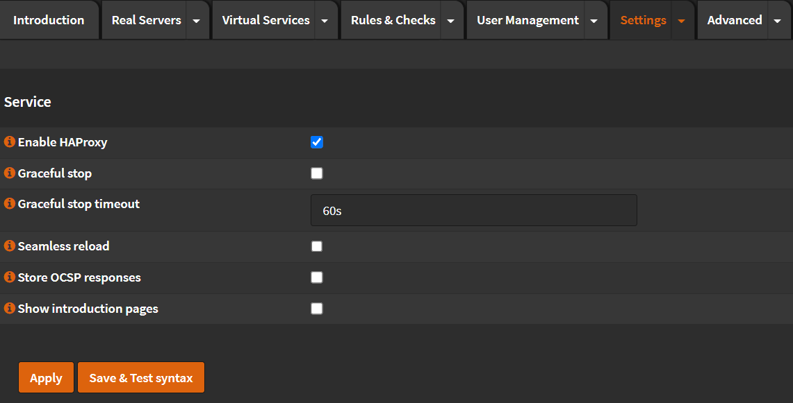

- Click `Apply`
- Check that HAProxy started (You should see a green ▶️ on the top right corner)

##### Global Parameters

- Click 🔽 next to `Settings` tab.
- Click `Global Parameters`
- Maximum connections: Set this to a number of at least 3 times your agents.


- Click `Apply`

##### Default Parameters

- Click 🔽 next to `Settings` tab.
- Click `Default Parameters`
- Maximum connections (Public Services): Set this to a number of at least 3 times your agents.
- Maximum connections (Servers): Set this to a number of at least 3 times your agents.
- Client Timeout: `120s`
- Connection Timeout: `120s`
- Retries: `3`


- Click `Apply`

#### Real Servers

Navigate to `Services` -> `HAProxy` -> `Settings`

- Click 🔽 next to `Real Servers` tab.
- Click `Real Servers`
- Click ➕
- Name: `Tactical`
- Type: `static`
- FQDN or IP: (Your Tactical RMM VM IP or FQDN)
- Port: `443`
- Mode: `active`
- SSL: `Unchecked`
- SSL SNI: (Empty)
- Verify SSL Certificate: `Unchecked`
- Click `Save`

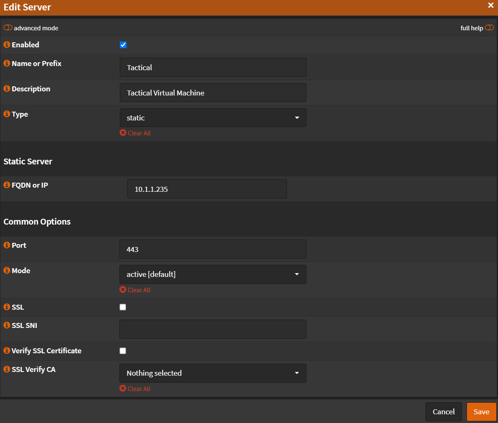

- Click `Apply`

#### Virtual Services - Backend Pools

Navigate to `Services` -> `HAProxy` -> `Settings`

- Click 🔽 next to `Virtual Services` tab.
- Click `Backend Pools`
- Click ➕
- Name: `Tactical`
- Description: `Tactical Server Pool`
- Mode: `TCP (Layer 4)`
- Health Checking: `Unchecked`
- Retries: `3`
- Click `Save`


- Click `Apply`

#### Rules & Checks

Navigate to `Services` -> `HAProxy` -> `Settings`

##### Conditions

- Click 🔽 next to `Rules & Checks` tab.
- Click `Conditions`
- Click ➕
- Name: `Contains SSL Hello Message`
- Condition type: `Custom condition (option pass-through)`
- Option pass-through: `req.ssl_hello_type 1`
- Click `Save`

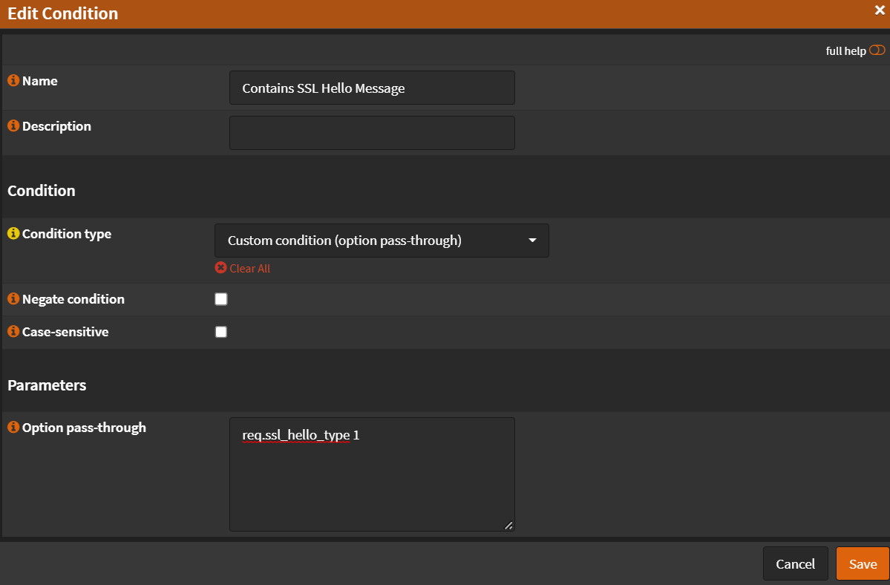

- Click ➕
- Name: `SNI Tactical`
- Description: `SNI Match tactical subdomains`
- Condition Type: `SNI TLS extension regex (TCP Request content inspection)`
- SNI Regex: `(api|tactical|mesh)\.yourdomain\.com`
- Click `Save`


- Click `Apply`

##### Rules

- Click 🔽 next to `Rules & Checks` tab.
- Click `Rules`
- Click ➕
- Name: `Accept Content if Contains SSL Hello`
- Select conditions: `Contains SSL Hello Message`
- Execute function: `tcp-request content accept`
- Click `Save`

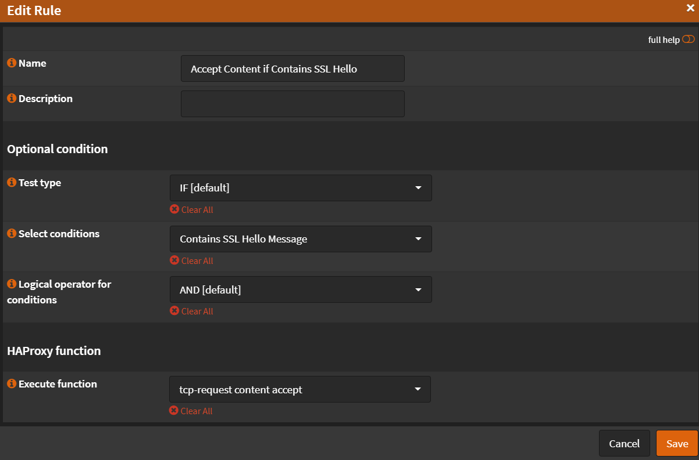

- Click ➕
- Name: `TCP Inspect Delay`
- Select conditions: `Nothing Selected`
- Execute function: `tcp-request inspect-delay`
- TCP inspection delay: `5s`
- Click `Save`


- Click ➕
- Name: `Tactical RMM`
- Select conditions: `SNI Tactical`
- Execute function: `Use specified Backend Pool`
- Use specified Backend Pool: `Tactical`
- Click `Save`


- Click `Apply`

#### Virtual Services - Public Services

Navigate to `Services` -> `HAProxy` -> `Settings`

- Click 🔽 next to `Virtual Services` tab.
- Click `Public Services`
- Click ➕
- Name: `Frontend`
- Listen Addresses: `127.0.0.1:443` (Remember, you have to have port forward + allow rule)
- Type: `SSL / HTTPS (TCP Mode)`
- Default Backend Pool: `none`
- SSL Offloading: `Unchecked`
- Maximum Connections: (Set this to a number of at least 3 times your agents.)
- Select Rules:
  - `Accept Content if Contains SSL Hello`
  - `TCP Inspect Delay`
  - `Tactical RMM`
- Click `Save`

> Note: Order on Rules matter!

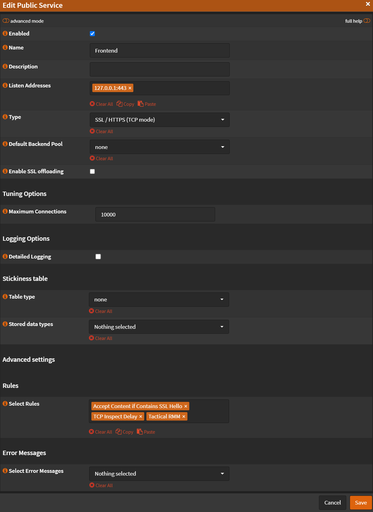

- Click `Apply`

## Apache Proxy
HowTo - Proxy on Apache
### TRMM SERVER
Edit file /etc/nginx/sites-available/rmm.conf
Add the lines from 'real_ip' module inside server tag:

```conf
set_real_ip_from    192.168.0.200; #IP Address of your apache proxy
real_ip_header      X-Forwarded-For;
```

Restart nginx:

```bash
systemctl restart nginx.service
```

### APACHE
Enable ssl proxy and rewriteEngine.
Set proxy to preserve host.
Set upgrade rule to websocket.
Set proxypass rules redirecting to rmm location.

Apache ssl config example:

```conf
<VirtualHost *:443>

    ServerName rmm.blablabla.com.br:443
    ServerAlias mesh.blablabla.com.br:443 api.blablabla.com.br:443
    SSLEngine on

    SSLCertificateFile "C:/Apache24/conf/ssl-rmm.blablabla.com.br/_.blablabla.com.br-chain.pem"
    SSLCertificateKeyFile "C:/Apache24/conf/ssl-rmm.blablabla.com.br/_.blablabla.com.br-key.pem"

    SSLProxyEngine on

    RewriteEngine On
    ProxyPreserveHost On

    # When Upgrade:websocket header is present, redirect to ws
    # Using NC flag (case-insensitive) as some browsers will pass Websocket
    RewriteCond %{HTTP:Upgrade} =websocket [NC]
    RewriteRule ^/(.*)    wss://192.168.0.212/$1 [P,L]

    ProxyPass "/"  "https://192.168.0..212/" retry=3
    ProxyPassReverse "/"  "https://192.168.0.212/" retry=3

    BrowserMatch "MSIE [2-5]" \
    		nokeepalive ssl-unclean-shutdown \
    		downgrade-1.0 force-response-1.0

</VirtualHost>
```

## Nginx Proxy Manager (double proxy method)

First, get your TRMM server installed with a standard config and working.

Then in NPM, declare the hosts with the parameters:

```
api.{domain}
https | TRMM server DNS name | 443
ON: Cache Assets | Block Common Exploits | Websockets Support

mesh.{domain}
https | TRMM server DNS name | 443
ON: Block Common Exploits | Websockets Support
Advanced:
proxy_set_header Host $host;
proxy_set_header CF-Connecting-IP $proxy_add_x_forwarded_for;
proxy_set_header X-Forwarded-Host $host:$server_port;
proxy_set_header X-Forwarded-For $proxy_add_x_forwarded_for;
proxy_set_header X-Forwarded-Proto $scheme;

rmm.{domain}
https | TRMM server DNS name | 443
ON: Cache Assets | Block Common Exploits | Websockets Support
```

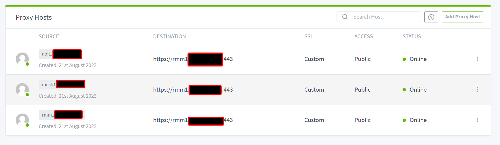

Last thing you have to do, is setup the same certs on NPM and TRMM.

TRMM cert location: `/etc/letsencrypt/live/{yourdomain}/`

NPM cert location: SSL Certificates tab

Either: Setup SSL certs on NPM (optionally using Cloudflare API). Download and copy certs to TRMM. Then run `./update.sh --force`

OR: Run standard TRMM cert renew process using certbot. Then copy the files and upload: Certificate Key (`privkey.pem`), Certificate (`cert.pem`), and Intermediate Certificate (`chain.pem`)

## Nginx Proxy Manager Alt Method

!!!note
    Tested and working on the following:<br>
    ✅ TRMM hosted on Ubuntu 22.04 via Proxmox VM<br>
    ✅ Nginx Proxy Manager hosted on Debian 11 via Proxmox CT W/ Docker

**We'll use "YOURDOMAIN" in place of your actual domain name**

### Step 1 - Install and test TRMM with no proxy

First and foremost, you need to disable Nginx Proxy Manager. To do this, on your routers firewall settings, forward ports 443 and 80 to the local ip that will be running your TRMM instance.
This is only temporary as we want to make sure we can get TRMM installed and running with a STANDARD install FIRST.
You will also need to make sure the following subdomains are pointing to your external IP:

> api.YOURDOMAIN.com
> 
> rmm.YOURDOMAIN.com
> 
> mesh.YOURDOMAIN.com

Use `curl icanhazip.com` to pull your external IP if you don't know it.

Once you have ports 443 and 80 forwarded correctly, go ahead and run a STANDARD install of TRMM on a FRESH machine. You can find the Install Documentation [here](https://docs.tacticalrmm.com/install_server/#installation).

### Step 2 - Nginx Proxy Manager Proxy Host Configuration

Assuming you installed TRMM properly and all of its features are working correctly, we will now get into setting up Nginx Proxy Manager to work with TRMM. Go ahead and forward ports 443 and 80 back to your Nginx Proxy Manager instance.

Below you will find the 3 different Proxy Hosts you need to create on Nginx Proxy Manager.

#### "API" Domain

Details Tab:

**Domain Name:** --> api.YOURDOMAIN.com

**Scheme:** --> https

**Forward Hostname / IP:** --> The Local IP of your TRMM instance. ie: 192.168.1.155

**Forward Port:** --> 443

**Enabled Options:**

```
Cache Assets;
Block Common Exploits;
Websockets Support
```

**Access List:** --> Publicly Accessible

#### "MESH" Domain

Details Tab:

**Domain Name:** --> mesh.YOURDOMAIN.com

**Scheme:** --> http

**Forward Hostname / IP:** --> The Local IP of your TRMM instance. ie: 192.168.1.155

**Forward Port:** --> 4430

**Enabled Options:**

```
Block Common Exploits;
Websockets Support
```

**Access List:** --> Publicly Accessible

Advanced Tab:

**Custom Nginx Configuration**

```
proxy_set_header Host $host;
proxy_set_header CF-Connecting-IP $proxy_add_x_forwarded_for;
proxy_set_header X-Forwarded-Host $host:$server_port;
proxy_set_header X-Forwarded-For $proxy_add_x_forwarded_for;
proxy_set_header X-Forwarded-Proto $scheme;
```

#### "RMM" Domain

Details Tab:

**Domain Name:** --> rmm.YOURDOMAIN.com

**Scheme:** --> https

**Forward Hostname / IP:** --> The Local IP of your TRMM instance. ie: 192.168.1.155

**Forward Port:** --> 443

**Enabled Options:**

```
Cache Assets;
Block Common Exploits;
Websockets Support
```

**Access List:** --> Publicly Accessible

#### NPM SSL Configuration

In order for TRMM to work properly with NPM, you'll need to create a wildcard or multi-domain SSL Certificate.

To do this, on the Nginx Proxy Manager Dashboard, click the *SSL Certificates* tab.


Now in the top right, click "Add SSL Certificate". Select "Let's Encrypt".


Add each of the domains listed above to the "Domain Names" field. Make sure you add them 1 at a time and click the dropdown of the domain to add it. Once you've added all 3 domains, enable the "I agree" tick and click save.

You should now see something like this in your list of SSL Certs:


Go ahead and download this certificate by clicking the 3 dots to the right of the cert entry and click "Download".

I suggest you follow [these](unsupported_scripts.md/#using-purchased-ssl-certs-instead-of-lets-encrypt-wildcards) instructions for adding the new certs to your TRMM instance. You will still need to keep TRMM's certs updated as well.

#### MeshCentral Configuration

Now you should have Nginx Proxy Manager completely setup. Lets move on to the MeshCentral Configuration.

First, cd to `/meshcentral/meshcentral-data`

Now edit the file named `config.json`.

Make sure your config file looks like the one shown below.

```json
{
  "settings": {
    "cert": "mesh.YOURDOMAIN.com",
    ....
    "tlsOffload": "Nginx Proxy Manager Local IP",
    "trustedProxy": "Nginx Proxy Manager Local IP",
    ....
  },
  "domains": {
    "": {
      ....
      "certUrl": "https://mesh.YOURDOMAIN.com:443/",
      ....
    }
  }
}
```

If you want to enable logging in case anything goes wrong during this process, follow the instructions [here](https://ylianst.github.io/MeshCentral/meshcentral/debugging/#logging-it-all).

As of now, everything should be working. If you have any issues, feel free to join the [discord](https://discord.com/invite/upGTkWp).

Keep in mind, this is considered an **UNSUPPORTED** installation. Developers are not obligated to fix any issues you may encounter. Good luck.

## Synology NAS Reverse Proxy Portal

Follow [HAProxy](#haproxy)

And set the "CertUrl" to point to the IP address of my NAS that was running the reserve proxy and had the certificates installed.

In Synology NAS reverse proxy portal and added websockets to the rmm domains, especially the mesh domain under custom headers, by just clicking the create button and choosing WebSocket:


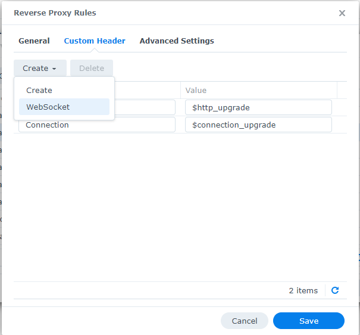
